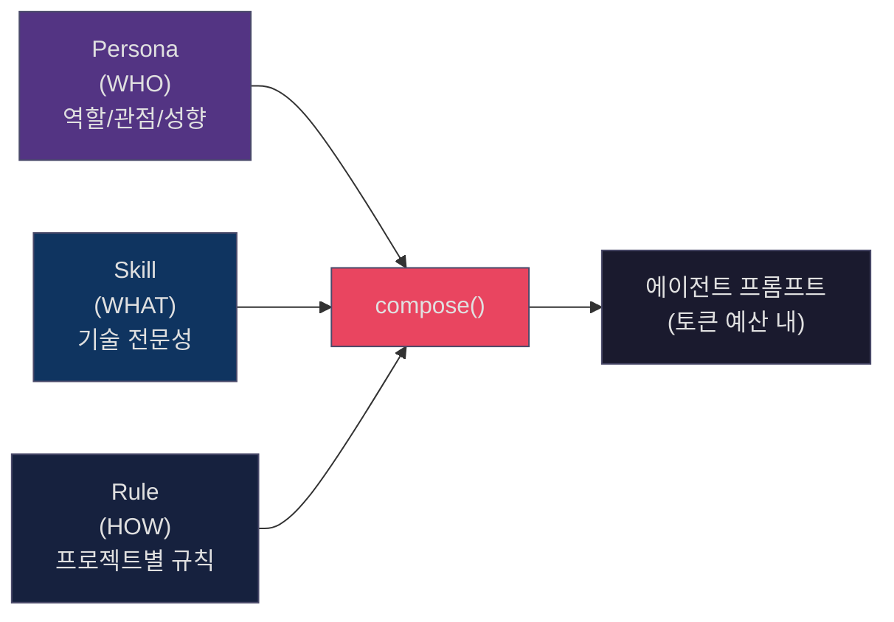
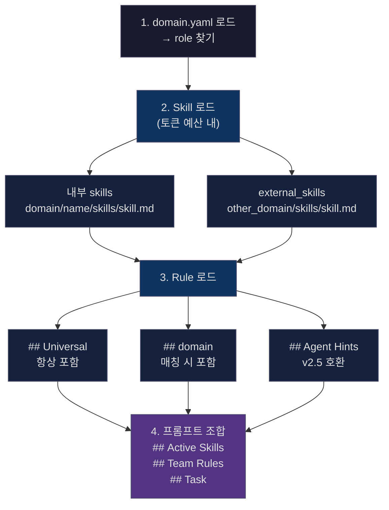

# AGENTS.md — JARFIS 에이전트 시스템 가이드

> JARFIS v3.0 에이전트 아키텍처의 설계 원리, 구성 요소, 확장 방법을 설명한다.
> 워크플로우 전체 흐름은 `WORKFLOW.md`, 인프라 구성은 `INFRASTRUCTURE.md`를 참조.

---

## 1. 개요

JARFIS의 에이전트 시스템은 **Persona + Skill + Rule** 3계층으로 구성된다.



**핵심 원칙**: Persona는 도메인 독립적(프로젝트에 관계없이 동일), Skill은 도메인 종속적(web/desktop 등), Rule은 프로젝트 종속적(learnings.md, project-context.md).

---

## 2. Persona (WHO)

### 2.1 Persona 목록

| name | model | color | 역할 |
|------|-------|-------|------|
| `backend-developer` | sonnet | red | 시스템 사고, DB 설계, API, 동시성, 에러 핸들링, 보안 |
| `frontend-developer` | sonnet | blue | 브라우저/UI, 디자인 충실도, 접근성, 성능 최적화 |
| `devops-engineer` | sonnet | cyan | CI/CD, 컨테이너, IaC, 모니터링, 안정성, 비용 |
| `product-owner` | opus | purple | 비즈니스 가치, JTBD, 우선순위, Working Backwards |
| `qa-engineer` | opus | orange | QA 분석, 테스트 설계, 버그 식별, 리스크, 호환성 |
| `security-engineer` | opus | yellow | 위협 모델링, 취약점, 인증/인가, 방어적 코딩 |
| `tech-lead` | opus | white | 코드 리뷰, 리팩토링, 기술 부채, 코딩 컨벤션 |
| `technical-architect` | opus | green | 기술 전략, 트레이드오프, NFR, ADR, 태스크 분해 |
| `ux-designer` | opus | pink | 사용자 공감, 시각 계층, 인터랙션, 브랜드, 접근성 |

- **위치**: `~/.claude/agents/jarfis/personas/{name}.md`
- **model 구분**: 실행(implement) 역할은 `sonnet` (속도/비용), 판단(plan/design/review) 역할은 `opus` (추론 깊이)

### 2.2 Persona Body 구조

모든 Persona는 동일한 4단 구조를 따른다:

```markdown
---
name: backend-developer
description: "..."
model: sonnet
color: red
---

## Core Identity          ← 역할의 본질, 관점(Perspective)
## Behavioral Guidelines  ← 문제 해결 접근, 코드 품질, 커뮤니케이션
## Judgment Framework      ← 의사결정 기준 (일부 Persona)
## Output Formatting       ← 응답 형식 규칙
```

### 2.3 v2.5 Legacy Persona와의 관계

`agents/jarfis/` 루트에는 v2.5 시절의 `senior-*` Persona가 남아 있다.

| v2.5 (모놀리식) | v3.0 (Persona only) | 차이 |
|---|---|---|
| `senior-backend-engineer.md` (107줄) | `backend-developer.md` (57줄) | v2.5는 기술 스택 목록 포함, v3.0은 관점/판단 기준만 |
| `senior-product-owner.md` | `product-owner.md` | 동일 패턴 |

**현재 상태**: `web.yaml`의 plan/design/review 페이즈는 `senior-*` (v2.5)를 참조하고, implement 페이즈는 v3.0 Persona를 참조한다. `desktop.yaml`은 모든 페이즈에서 v3.0 Persona를 참조한다. `validate` 함수는 `agents/jarfis/` 전체를 재귀 탐색하므로 양쪽 모두 발견된다.

---

## 3. Skill (WHAT)

### 3.1 Skill 구조

모든 Skill 파일은 3단 구조를 따른다:

```markdown
# {Skill Name} Expertise

## Core Patterns         ← 핵심 패턴, 의사결정 프레임워크
## Decision Framework    ← 선택지별 트레이드오프 (일부 Skill)
## Common Pitfalls       ← 빈번한 실수와 방지법
```

- **위치**: `~/.claude/commands/jarfis/domains/{domain}/skills/{skill}.md`
- **크기 제한**: 256KB (`MAX_SKILL_FILE_SIZE`)

### 3.2 설치된 Skill 목록

**Web 도메인** (6개):

| Skill | 줄 수 | 주요 내용 |
|-------|-------|----------|
| `nodejs` | 28 | Event Loop, TypeScript 패턴, 에러 핸들링, DB 패턴 |
| `react` | 26 | Hooks, 상태관리 프레임워크, Next.js, RSC |
| `express` | 23 | 미들웨어, 에러 핸들링, NestJS 패턴 |
| `browser` | 28 | 크로스 브라우저, Web API, 성능 최적화 |
| `biome-lint` | 25 | Biome 린터/포매터 설정, 규칙 커스텀 |
| `vue` | 21 | Composition API, Pinia, Vue Router |

**Desktop 도메인** (4개):

| Skill | 줄 수 | 주요 내용 |
|-------|-------|----------|
| `rust` | 31 | Ownership, 에러 핸들링, 동시성, Async 패턴 |
| `tauri-backend` | 31 | Command 정의, 상태관리, 이벤트, 플러그인 |
| `tauri-webview` | 33 | invoke(), Event System, WebView 제약, React 통합 |
| `cargo-clippy` | 21 | Clippy 린트 규칙, 허용/거부 설정 |

### 3.3 외부 스킬 참조 (external_skills)

도메인 간 스킬 공유가 가능하다. `desktop.yaml`의 `webview_engineer`가 대표적 예시:

```yaml
# desktop.yaml
implement:
  - name: webview_engineer
    persona: frontend-developer
    skills: ["tauri-webview"]
    external_skills: ["web/react"]   # ← web 도메인의 react 스킬 참조
```

`compose()` 함수는 `external_skills`를 `{domain}/{skill}` 형식으로 파싱하여 해당 도메인의 스킬 파일을 로드한다.

---

## 4. Domain Pack

### 4.1 _schema.yaml (EP1~EP7)

도메인 팩은 7개 Extension Point로 구성된다:

| EP | 이름 | 설명 |
|----|------|------|
| EP1 | Agent Composition | 페이즈별 역할(Persona + Skill) 배정 |
| EP2 | Framework Detection | 프로젝트 자동 감지 (indicator 기반) |
| EP3 | Quality Gates | 린터, 타입 체커 설정 |
| EP4 | Commit Format | 커밋 메시지 형식 (`jarfis({ROLE}-{N}):`) |
| EP5 | MCP Integration | 필수/선택 MCP 서버 |
| EP6 | Test & Build | 테스트 러너, 빌드 체크 |
| EP7 | Domain Lifecycle | 설치/초기화/업그레이드 훅 |

추가로 **Hooks** (페이즈별 before/after), **Fallback** (에러 시 동작) 섹션이 있다.

### 4.2 web.yaml vs desktop.yaml 비교

```
                  web.yaml                    desktop.yaml
                  ────────                    ────────────
plan              senior-product-owner        product-owner
                  technical-architect         technical-architect

design            technical-architect         technical-architect
                  tech-lead                   tech-lead
                  senior-ux-designer

implement (3)     backend_engineer            rust_engineer
                    BE: nodejs, express         RS: rust, tauri-backend
                  frontend_engineer           webview_engineer
                    FE: react, browser          WV: tauri-webview
                  devops_engineer                  + external: web/react
                    DevOps: (no skills)

review            tech-lead                   tech-lead
                  senior-qa-engineer
                  senior-security-engineer

detect            package.json 기반            tauri.conf.json 기반
                  (react, vue, next, etc.)    Cargo.toml "tauri" key

quality           biome + tsc                 cargo clippy + biome
pipeline          npm test / npm run build    cargo test / cargo check
mcp               playwright, chrome-devtools  (없음)
```

### 4.3 새 도메인 팩 만들기

```bash
# 1. 스캐폴드 생성
jarfis domain scaffold my-domain

# 생성되는 구조:
# ~/.claude/commands/jarfis/domains/
#   my-domain.yaml              ← 도메인 설정
#   my-domain/
#     skills/                   ← 스킬 파일들
#     hooks/                    ← 페이즈별 훅
#     templates/                ← 템플릿

# 2. my-domain.yaml 편집 (EP1~EP7 설정)
# 3. skills/*.md 작성
# 4. 유효성 검증
jarfis domain validate my-domain
```

스캐폴드는 최소 유효 YAML을 생성하며, `_schema.yaml`의 주석을 참고하여 각 EP를 설정한다.

---

## 5. compose() — 에이전트 프롬프트 조합

### 5.1 함수 시그니처

```python
compose(domain_name, role_name, task,
        learnings_path=None, project_context_path=None)
```

### 5.2 조합 흐름



### 5.3 토큰 예산 관리

- **기본 예산**: 2,500 토큰 (`max_skill_tokens`)
- **CJK 인식**: 한글/일본어/중국어는 문자당 ~0.5 토큰, ASCII는 ~0.25 토큰으로 계산
  - 공식: `chars_per_token = 4 - (2 * cjk_ratio)`
- **W1-1 보장**: 첫 번째 스킬은 예산을 초과하더라도 반드시 로드됨
- **초과 시**: 우선순위 순서대로 절삭, `truncated_skills`에 사유 기록

### 5.4 반환값

```python
{
    "agent_type": "backend-developer",  # Persona 이름
    "prompt_content": "## Active Skills\n...\n## Task\n...",
    "token_count": 1850,
    "loaded_skills": ["nodejs", "express"],
    "truncated_skills": [],             # 절삭된 스킬 + 사유
    "fallback": False,                  # Fallback 모드 여부
}
```

### 5.5 Fallback 동작

도메인 설정 로드 실패 시 **persona-only** 모드로 실행:

```python
_FALLBACK_PERSONAS = {
    "backend_engineer": "backend-developer",
    "frontend_engineer": "frontend-developer",
    "devops_engineer": "devops-engineer",
    "rust_engineer": "backend-developer",
    "webview_engineer": "frontend-developer",
    # ...
}
```

Skill 없이 Task만 포함된 프롬프트를 생성한다. `fallback: True`로 표시.

---

## 6. Framework Detection

### 6.1 동작 원리

`detect()` 함수는 모든 설치된 도메인 팩의 `indicators`를 프로젝트 디렉토리에 대해 평가한다.

```yaml
# web.yaml 예시
detect:
  indicators:
    - file: "package.json"
      key: "react"
      framework: "react"
      confidence: 0.9
    - file: "tsconfig.json"
      framework: "typescript"
      confidence: 0.7
```

**매칭 로직**:
1. `file` 존재 확인
2. `key` 지정 시 파일 내 substring 매칭
3. `manifest` + `key` 조합도 지원 (desktop.yaml의 `Cargo.toml` + `"tauri"`)
4. 매칭된 indicator들의 평균 confidence 계산

**결정성 보장**: 결과는 `(-confidence, domain_name)` 순 정렬. 상위 2개의 confidence가 동일하면 `tie: true` 반환.

### 6.2 CLI 사용

```bash
jarfis domain detect /path/to/project
# → {"matches": [{"domain": "web", "confidence": 0.85, ...}], "tie": false}
```

---

## 7. Rule (HOW)

### 7.1 learnings.md 구조

`compose()`의 `load_filtered_rules()`가 실제로 파싱하는 `##` 레벨 섹션:

```markdown
## Universal
(모든 도메인에서 항상 로드)

## web
(domain_name == "web"일 때 로드)

## desktop
(domain_name == "desktop"일 때 로드)

## Agent Hints
(v2.5 호환 — 레거시 포맷, 있으면 그대로 로드)
```

> **참고**: `_extract_section()`은 `## {heading}` 레벨만 추출한다. 하위 `###`, `####` 구조는 해당 `##` 섹션의 본문으로 통째로 포함된다. learnings.md 내부에서 `### {Role}` > `#### Universal/Project-Specific` 같은 세부 구조를 자유롭게 쓸 수 있지만, 파서가 인식하는 단위는 `##` 헤딩이다.

### 7.2 project-context.md 구조

코드베이스 구조, 주요 컨벤션, 참조 경로, 주의사항을 기술한다. 항상 로드된다.

### 7.3 파일 크기 제한

| 파일 유형 | 제한 |
|-----------|------|
| Skill (.md) | 256KB (`MAX_SKILL_FILE_SIZE`) |
| Rule (learnings.md, project-context.md) | 1MB (`MAX_SKILL_FILE_SIZE * 4`) |

---

## 8. Validation

### 8.1 도메인 팩 검증

```bash
jarfis domain validate web
```

검증 항목:
- YAML 문법 및 스키마 준수
- 참조된 Persona 파일 존재 여부 (`agents/jarfis/` 재귀 탐색)
- 참조된 Skill 파일 존재 여부 (warning — 아직 생성 전일 수 있음)
- 토큰 예산 초과 경고 (단일 스킬 > 예산, 총합 > 예산)

### 8.2 도메인 이름 규칙

```
DOMAIN_NAME_RE = ^[a-z][a-z0-9-]{0,30}$
SKILL_NAME_RE  = ^[a-zA-Z0-9_-]+$
```

---

## 9. 보안

### 9.1 경로 탐색 방지

`_resolve_skill_path()`는 3단계 방어:

1. **이름 패턴 검증**: `DOMAIN_NAME_RE`, `SKILL_NAME_RE`로 입력 필터링
2. **경로 정규화**: `os.path.realpath()`로 심볼릭 링크 해소
3. **경계 검증**: 정규화된 경로가 `domains/` 디렉토리 내부인지 `startswith` 확인

```python
base = os.path.realpath(domains_dir)
resolved = os.path.realpath(os.path.join(domains_dir, domain, "skills", f"{skill}.md"))
if not resolved.startswith(base):
    raise ValueError(f"Path traversal detected: {skill}")
```

### 9.2 DoS 방지

- Skill 파일: 256KB 초과 시 로드 거부 (`truncated_skills`에 `file_too_large` 사유)
- Rule 파일: 1MB 초과 시 빈 문자열 반환

---

## 10. Dialectic Review

JARFIS 시스템 자체의 변경 사항을 검토하는 토론 메커니즘.

### 10.1 참여자

| 역할 | 파일 | 관점 |
|------|------|------|
| **Advocate** (green) | `jarfis-advocate.md` | 장점, 가능성, 사용자 가치 |
| **Critic** (red) | `jarfis-critic.md` | 리스크, 부작용, 일관성 |

### 10.2 프로토콜

- 라운드당 최대 **300단어**
- 최대 **2라운드**
- 합의 표기: ✅ 합의 / ⚠️ 조건부 합의 / ❌ 사용자 판단 필요
- 평가 축: 구체성, 건설성, 범용성, 토큰 경제

---

## 11. 파일 시스템 맵

```
~/.claude/
├── agents/jarfis/
│   ├── personas/                    ← v3.0 Persona (9개)
│   │   ├── backend-developer.md
│   │   ├── frontend-developer.md
│   │   ├── devops-engineer.md
│   │   ├── product-owner.md
│   │   ├── qa-engineer.md
│   │   ├── security-engineer.md
│   │   ├── tech-lead.md
│   │   ├── technical-architect.md
│   │   └── ux-designer.md
│   ├── senior-backend-engineer.md   ← v2.5 Legacy Persona
│   ├── senior-product-owner.md
│   ├── senior-qa-engineer.md
│   ├── senior-security-engineer.md
│   ├── senior-ux-designer.md
│   ├── tech-lead.md                 ← v2.5 (frontmatter name: senior-tech-lead)
│   ├── technical-architect.md       ← v2.5 (frontmatter name: senior-technical-architect)
│   │   ※ 파일명 ≠ frontmatter name. validate는 frontmatter name으로 매칭.
│   ├── jarfis-advocate.md           ← Dialectic Review
│   └── jarfis-critic.md
├── commands/jarfis/domains/
│   ├── _schema.yaml                 ← EP1~EP7 스키마 정의
│   ├── web.yaml                     ← Web 도메인 팩
│   ├── desktop.yaml                 ← Desktop (Tauri) 도메인 팩
│   ├── web/skills/                  ← Web 스킬 (6개)
│   │   ├── nodejs.md
│   │   ├── react.md
│   │   ├── express.md
│   │   ├── browser.md
│   │   ├── biome-lint.md
│   │   └── vue.md
│   └── desktop/skills/              ← Desktop 스킬 (4개)
│       ├── rust.md
│       ├── tauri-backend.md
│       ├── tauri-webview.md
│       └── cargo-clippy.md
└── ...

jarfis/scripts/jarfis/
├── domain.py                        ← compose(), detect(), validate(), scaffold()
└── validate.py                      ← 워크플로우 상태/아티팩트 검증
```

---

## 부록: 관련 문서

| 문서 | 내용 |
|------|------|
| `PHILOSOPHY.md` | JARFIS 설계 철학 |
| `_schema.yaml` | Domain Pack 스키마 정의 (EP1~EP7 전체 주석) |
| `WORKFLOW.md` | 워크플로우 페이즈별 동작 (참조 예정) |
| `DESIGN.md` | 시스템 설계 결정 기록 (참조 예정) |
| `INFRASTRUCTURE.md` | 인프라/배포 구성 (참조 예정) |
