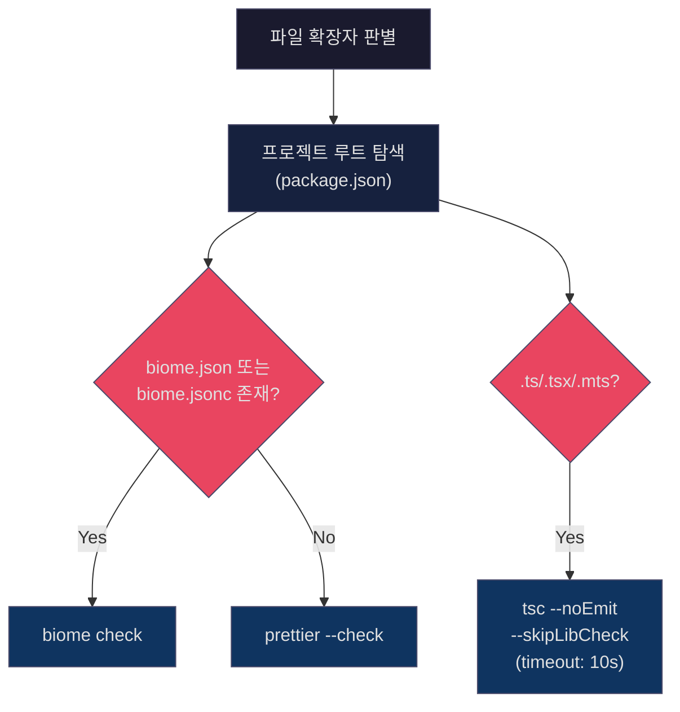

# JARFIS Infrastructure

> JARFIS 내부 구조를 이해하고 싶은 사용자/기여자를 위한 기술 인프라 문서.
> 워크플로우 설계는 [DESIGN.md](DESIGN.md), 에이전트 역할 정의는 [AGENTS.md](AGENTS.md) 참조.

---

## 1. 시스템 개요

JARFIS는 Claude Code의 Hook 시스템 위에서 동작하는 IT 워크플로우 오케스트레이터이다.
`~/.claude/`에 설치되어 CLI 디스패처, Python 모듈 17개, Shell Hook 4개로 구성된다.

```
~/.claude/
├── scripts/
│   ├── jarfis_cli.py          # CLI 디스패처 (진입점)
│   └── jarfis/                # Python 패키지 (17개 모듈)
├── hooks/
│   ├── jarfis-pre-compact.sh  # PreCompact: state/meeting 백업
│   ├── jarfis-safety.sh       # PreToolUse: 위험 명령 차단
│   ├── jarfis-quality-gate.sh # PostToolUse: lint/typecheck
│   └── jarfis-session-start.sh# SessionStart: 컨텍스트 복원
├── commands/jarfis/           # 슬래시 커맨드 정의
│   ├── domains/               # 도메인 팩 (web, desktop 등)
│   ├── prompts/               # 페이즈별 에이전트 프롬프트
│   └── templates/             # 아티팩트 템플릿
└── agents/jarfis/             # 에이전트 페르소나 정의
```

### 의존성 구조

| 계층 | 의존성 | 모듈 |
|------|--------|------|
| Core | stdlib only | state, audit, trace, measure, preflight, validate, version, sync, meetings, organization, detect, level_check, utils |
| Domain | pyyaml | domain |
| Search | sentence-transformers, numpy, torch | wiki_search |

코어 모듈은 외부 의존성이 없으므로 어떤 Python 3.x 환경에서든 동작한다.

---

## 2. CLI 디스패처 (`jarfis_cli.py`)

모든 JARFIS CLI 호출의 진입점. 13개 명령어를 Python 모듈로 라우팅한다.

```python
# scripts/jarfis_cli.py — 명령어-모듈 매핑
commands = {
    "state": "jarfis.state",
    "detect": "jarfis.detect",
    "measure": "jarfis.measure",
    "preflight": "jarfis.preflight",
    "meetings": "jarfis.meetings",
    "version": "jarfis.version",
    "sync": "jarfis.sync",
    "quality-gate": "jarfis.quality_gate",
    "validate": "jarfis.validate",
    "org": "jarfis.organization",
    "wiki": "jarfis.wiki_search",      # deprecated → search 사용
    "search": "jarfis.wiki_search",
    "domain": "jarfis.domain",
}
```

### Venv 재실행

`wiki`와 `search` 명령은 sentence-transformers를 요구하므로, 전용 venv가 존재하면 자동으로 재실행한다.

```python
VENV_COMMANDS = {"wiki", "search"}
VENV_DIR = os.path.join(os.path.expanduser("~"), ".claude", ".jarfis-venv")

def _needs_venv_reexec(venv_dir=None):
    # venv의 site-packages가 sys.path에 없으면 재실행 필요
    # homebrew symlink 문제 회피: realpath 비교 대신 site-packages 존재 확인
    venv_lib = os.path.join(venv_dir, "lib")
    for p in sys.path:
        if p.startswith(venv_lib) and "site-packages" in p:
            return False
    return True
```

재실행 시 `os.execv`로 프로세스를 교체하므로 추가 오버헤드가 없다.

---

## 3. 17개 Python 모듈

### 3.1 utils.py — 공유 유틸리티

경로 해석과 JSON 입출력을 담당하는 최하위 모듈.

| 함수 | 역할 |
|------|------|
| `get_claude_dir()` | `~/.claude` 경로 반환 |
| `get_source_path()` | `.jarfis-source` 읽어 repo 경로 반환 (fallback: `~/repos/jarfis`) |
| `get_personal_dir()` | `.jarfis-personal-dir` → `{source}/.personal` 순으로 해석 |
| `get_org_dir(project_dir)` | org-aware 워크스페이스 디렉토리 (`orgs/{org_name}/`) |
| `find_org_root(project_dir)` | 상위 5단계까지 `.jarfis/org-profile.md` 탐색 |

`STANDALONE_ORG = "_standalone"` — Organization에 속하지 않는 프로젝트의 기본 org 이름.

### 3.2 state.py — 워크플로우 상태 관리

`.jarfis-state.json` CRUD. 7개 서브커맨드:

| 서브커맨드 | 설명 |
|-----------|------|
| `read` | 전체 또는 dot-path 키 읽기 |
| `write` | JSON 전체 덮어쓰기 |
| `set` | 단일 top-level 키 설정 |
| `set-nested` | dot-path 키 설정 (예: `phases.4.status`) |
| `init` | 워크플로우 초기화 (상태 파일 생성) |
| `validate` | 스키마 구조 검증 |
| `list-workflows` | 전체 org 워크스페이스 스캔 |

**감사 로그 연동**: `set`/`set-nested` 실행 시 `_try_audit`로 best-effort 감사 로그를 기록한다. 실패해도 상태 변경을 차단하지 않는다 (P9 원칙).

**완료 판정 3조건** (하나라도 충족 시 완료):
```python
is_done = (
    status == "completed"
    or str(cp) == "done"
    or phases.get("6", {}).get("status") == "completed"
)
```

### 3.3 domain.py — 도메인 팩 시스템

도메인 팩의 레지스트리, 감지, 구성, 검증을 담당. 7개 서브커맨드: `list`, `detect`, `agents`, `compose`, `validate`, `scaffold`, `install`.

#### compose — 에이전트 프롬프트 합성

`compose`는 도메인 팩의 핵심 함수로, Persona + Skills + Rules를 하나의 프롬프트로 합성한다.

```python
def compose(domain_name, role_name, task, ...):
    # 1. Skills 로딩 — 토큰 예산 2500 이내
    #    W1-1: 첫 번째 스킬은 예산 초과해도 반드시 로딩 (최소 1스킬 보장)
    #    W1-2: CJK 문자는 ~2 char/token, ASCII는 ~4 char/token
    # 2. External skills — 동일 예산 공유
    # 3. Rules 필터링 — 태그 기반 (R3)
    # 4. 프롬프트 합성 → {Active Skills, Team Rules, Task}
    # F1/F2: 설정 로드 실패 시 fallback (persona-only 실행)
```

#### 보안

| 보호 | 구현 |
|------|------|
| 경로 탐색 방지 | `os.path.realpath` + `startswith` 검증 |
| 이름 패턴 검증 | `DOMAIN_NAME_RE`, `SKILL_NAME_RE` 정규식 |
| 파일 크기 제한 | `MAX_SKILL_FILE_SIZE = 256KB` |
| 규칙 파일 크기 | 최대 1MB (256KB x 4) |

### 3.4 audit.py — 감사 로그

append-only JSONL 형식의 이벤트 로그. 14개 이벤트 타입:

```python
EVENT_TYPES = [
    "WorkflowStarted", "WorkflowCompleted", "WorkflowAborted",
    "PhaseStarted", "PhaseCompleted",
    "AgentInvoked", "AgentCompleted", "AgentFailed",
    "QualityGateEvaluated", "GateApproved",
    "RatchetChecked",
    "AutoCommit",
    "FallbackTriggered", "CircuitBreakerChanged",
]
```

**손상 내성**: `read_events`는 파싱 실패 라인을 건너뛴다. 프로세스 강제 종료 시 불완전한 JSON 라인이 생길 수 있지만, audit.jsonl은 복구 소스가 아니므로 (P9) 기능에 영향 없음.

### 3.5 trace.py — 성능 트레이싱

`traces.jsonl`에 에이전트/페이즈 성능 메트릭을 기록한다.

```python
@contextmanager
def trace_agent(trace_path, trace_id, phase, persona, skills):
    span_id = f"agent-{persona}-{uuid.uuid4().hex[:8]}"
    start = time.monotonic()
    yield span_id
    duration_ms = int((time.monotonic() - start) * 1000)
    # → {"traceId", "spanId", "parentSpanId": "phase-{N}", "duration_ms", ...}
```

`parentSpanId`로 에이전트 호출을 페이즈에 연결하여 계층적 트레이스를 구성한다.

### 3.6 preflight.py — 사전 검증

워크플로우 시작 전 환경 상태를 점검한다. 8개 체크 항목:

1. 프로젝트 프로필 존재 (`project-profile.md`)
2. Learnings 파일 존재 (`learnings.md`)
3. Project context 존재 (`project-context.md`)
4. Git 상태 (저장소 여부, 브랜치, 미커밋 변경)
5. Organization 감지 (`find_org_root`)
6. Org 자동 등록 (`register_org`)
7. 프로젝트 자동 추가 (`ensure_project_in_org_profile`)
8. 미팅 디렉토리 확인 (옵션)

### 3.7 quality_gate.py — 코드 품질 게이트

편집된 파일에 대해 lint/typecheck를 실행한다.



**지원 확장자**:

| 구분 | 확장자 |
|------|--------|
| TypeScript | `.ts`, `.tsx`, `.mts` |
| JavaScript | `.js`, `.jsx`, `.mjs` |
| Format-only | `.json`, `.css`, `.scss` |

**절대 차단 안 함**: PostToolUse 훅으로 실행되므로 항상 `exit 0`. 경고만 stderr로 출력.

### 3.8 organization.py — Organization 관리

`init`, `scan`, `info` 서브커맨드. 프로젝트 스캔 시 제외 디렉토리:

```python
EXCLUDE_DIRS = {
    "node_modules", ".git", "dist", "build", ".next", "__pycache__",
    "venv", ".venv", ".tox", "coverage", ".nyc_output", ".turbo",
}
```

Wiki 구조 생성: `INDEX.md`, 섹션별 `_index.md` (PO, DESIGN, TA, QA).

### 3.9 wiki_search.py — 시맨틱 검색

bge-m3 모델 기반 시맨틱 검색. 4개 스코프: `all`, `meetings`, `works`, `wiki`.

| 설정 | 값 |
|------|-----|
| 모델 | `BAAI/bge-m3` |
| CPU 강제 | `CUDA_VISIBLE_DEVICES=""` (MPS 패닉 방지) |
| 메모리 가드 | 기본 4GB (`JARFIS_MEMORY_THRESHOLD_GB`) |
| 점수 임계값 | `SCORE_THRESHOLD = 0.5` |
| 기본 결과 수 | `DEFAULT_TOP_K = 5` |
| 청크 토큰 임계값 | 500 (chars/4 근사) |

메모리 확인: macOS는 `vm_stat` (free + speculative + inactive pages), Linux는 `/proc/meminfo` MemAvailable.

### 3.10 validate.py — 워크플로우 검증

5단계 검증:

1. **State 구조** — `state.py`의 `cmd_validate` 재사용
2. **아티팩트 존재** — `PHASE_ARTIFACTS` 딕셔너리 기반
3. **조건부 아티팩트** — UX Designer 필요 시 `ux-direction.md`, `design/` 확인
4. **Wiki 구조** — `INDEX.md`, 섹션별 `_index.md` 존재 확인
5. **Git 상태** — 미커밋 변경 경고

```python
PHASE_ARTIFACTS = {
    "1": ["press-release.md", "prd.md"],
    "2": ["impact-analysis.md", "architecture.md", "tasks.md", "test-strategy.md"],
    "4": [],  # 코드 변경, 아티팩트 파일 없음
    "4.5": ["deployment-plan.md"],
    "5": ["review.md"],
    "6": ["retrospective.md"],
}
```

### 3.11 measure.py — 토큰 측정

프롬프트 파일의 토큰 수를 추정한다. **바이트 기반** `chars // 4` 공식 사용 (domain.py의 `estimate_tokens`와는 별도 — 그쪽은 CJK 비율에 따라 2~4 char/token 동적 조정).

`--diagnostics` 옵션 시 추가 분석: 코드블록 비율, 헤더 목록, 프롬프트 패턴 감지.

### 3.12 version.py — 버전 범프

semver 버전을 5개 파일에 동시 업데이트:

1. `VERSION` — 소스 repo 마스터 버전
2. `~/.claude/.jarfis-version` — 설치된 버전
3. `__init__.py` — Python 패키지 버전
4. `jarfis-index.md` — 인덱스 문서의 버전/날짜
5. `CHANGELOG.md` — `[Unreleased]` 섹션을 새 버전으로 릴리스

### 3.13 sync.py — 동기화

`~/.claude/` → repo 방향의 단방향 동기화. README.md의 3개 HTML 마커 구간을 갱신한다:
- `<!-- JARFIS-COMMANDS-START/END -->` — 명령어 테이블
- `<!-- JARFIS-ARCHITECTURE-START/END -->` — 파일 구조
- `<!-- JARFIS-LATEST-CHANGES-START/END -->` — CHANGELOG 최신 버전

### 3.14 meetings.py — 미팅 목록

org-aware `meetings/` 디렉토리를 탐색하여 `summary.md`가 있는 미팅을 최신순으로 반환. frontmatter 파싱으로 메타데이터 추출.

### 3.15 detect.py — 프로젝트 감지

9개 언어, 26개 이상의 프레임워크를 감지:

| 언어 | 프레임워크 |
|------|-----------|
| JavaScript/TypeScript | Next.js, Nuxt, React, Vue, Svelte, Angular, Solid, Astro, Remix, SvelteKit, Express, Fastify, NestJS, Koa, Hono, React Native, Electron |
| Java/Kotlin | Spring Boot |
| Python | Django, Flask, FastAPI |
| Go | Gin, Echo, Fiber |
| Rust | (Cargo.toml 기반) |
| Dart | Flutter |
| Ruby | Rails |

### 3.16 level_check.py — 성숙도 평가

독립 모듈 (stdlib only). 로컬 Claude Code 환경을 스캔하여 AI-native 개발 성숙도 데이터를 수집.

### 3.17 __init__.py — 패키지 초기화

`__version__` 문자열 정의. `version.py`의 범프 대상.

---

## 4. Hook 시스템

4개 Hook이 Claude Code 라이프사이클에 통합된다.

### 4.1 PreCompact Hook (`jarfis-pre-compact.sh`)

| 항목 | 값 |
|------|-----|
| 트리거 | PreCompact (auto-compact 직전) |
| timeout | 10,000ms |
| JSON 파싱 | jq 우선, python3 fallback |

**동작**:
1. 전체 org 워크스페이스에서 `.jarfis-state.json` 탐색
2. state 백업 → `.compact-backups/state_{timestamp}.json` (최대 10개 유지)
3. 진행 중 meeting 파일 백업 (summary.md, meeting-notes.md 등, 최대 20개 유지)

### 4.2 Safety Hook (`jarfis-safety.sh`)

| 항목 | 값 |
|------|-----|
| 트리거 | PreToolUse (Bash tool matcher) |
| timeout | 5,000ms |
| kill switch | `JARFIS_SAFETY_HOOK=0` |

**BLOCK (exit 2)**:
- `git push --force` / `-f`
- `--no-verify` 플래그
- main/master 브랜치 직접 커밋

**WARN (stderr, exit 0)**:
- `.env` 파일 접근
- `rm -rf` 패턴
- credentials/secret 파일 패턴
- `curl | bash` 패턴

### 4.3 Quality Gate Hook (`jarfis-quality-gate.sh`)

| 항목 | 값 |
|------|-----|
| 트리거 | PostToolUse (Edit\|Write\|MultiEdit matcher) |
| timeout | 12,000ms |
| kill switch | `JARFIS_QUALITY_GATE=0` |

**절대 차단 안 함**: PostToolUse는 항상 `exit 0`으로 종료. 파일 편집 후 `jarfis_cli.py quality-gate`를 호출하여 lint/typecheck 경고를 stderr로 출력.

### 4.4 SessionStart Hook (`jarfis-session-start.sh`)

| 항목 | 값 |
|------|-----|
| 트리거 | SessionStart (`.*` matcher) |
| timeout | 8,000ms |
| kill switch | `JARFIS_SESSION_RESTORE=0` |

**동작**:
1. ASCII 아트 배너 출력 (stderr → 터미널 전용, 토큰 0)
2. `jarfis_cli.py state list-workflows`로 미완료 워크플로우 감지
3. 워크플로우명, 현재 페이즈, 마지막 체크포인트, 핵심 결정사항 출력
4. Wiki 미반영 워크플로우 알림

---

## 5. State 스키마

`.jarfis-state.json`의 구조:

```json
{
  "project_name": "string",
  "work_name": "string",
  "work_input": "string",
  "docs_dir": "string (아티팩트 저장 경로)",
  "branch": "string",
  "branches": {},
  "source_meeting": "string | null",
  "started_at": "ISO 8601",
  "status": "in-progress | completed | aborted",
  "key_decisions": ["string"],
  "current_phase": "int | float | 'done'",
  "workspace": {},
  "phases": {
    "0": {"status": "pending | in_progress | completed | skipped"},
    "1": {"status": "..."},
    "2": {"status": "..."},
    "3": {"status": "..."},
    "4": {"status": "..."},
    "4.5": {"status": "..."},
    "5": {"status": "..."},
    "6": {"status": "..."}
  },
  "required_roles": {},
  "gate_results": {},
  "last_checkpoint": {
    "timestamp": "ISO 8601",
    "phase": 0,
    "summary": "string"
  }
}
```

페이즈 0~6 (4.5 포함, 총 8개 키). 각 페이즈의 status 유효값: `pending`, `in_progress`, `completed`, `skipped`.

---

## 6. 설치 (`install.sh`)

7단계 설치 프로세스:

| 단계 | 설명 |
|------|------|
| 1. 백업 | 기존 commands/, agents/, hooks/, scripts/ 백업 |
| 2. Learned Rules 추출 | 에이전트 파일의 `## Learned Rules` 섹션 임시 저장 |
| 3. 파일 설치 | commands, agents, hooks, scripts, statusline 복사 |
| 4. .personal 설정 | `orgs/_standalone/` 생성, learnings 마이그레이션 |
| 5. Rules 재적용 | 추출한 Learned Rules를 새 에이전트 파일에 병합 |
| 6. Hook 등록 | `settings.json`에 4개 hook 등록 (jq 필요) |
| 7. 버전 스탬프 | `.jarfis-version`, `.jarfis-source` 기록 |

**Hook timeout 설정** (settings.json):

| Hook | timeout |
|------|---------|
| PreCompact | 10,000ms |
| PreToolUse (Safety) | 5,000ms |
| PostToolUse (QualityGate) | 12,000ms |
| SessionStart | 8,000ms |

---

## 7. 테스트

| 항목 | 수치 |
|------|------|
| 테스트 함수 | 294개 |
| 테스트 파일 | 18개 테스트 파일 + `conftest.py` + `__init__.py` |
| 아키텍처 테스트 | `test_architecture.py` (3 테스트 클래스) |

### 아키텍처 테스트 (`test_architecture.py`)

Clean Architecture 경계를 자동 검증한다:

**TestLeakyAbstraction**: 코어 모듈 8개가 도메인 특정 용어(react, vue, django 등 14개)를 참조하지 않는지 검증.

```python
CORE_MODULES = [
    "state.py", "measure.py", "preflight.py",
    "meetings.py", "version.py", "sync.py",
    "validate.py", "organization.py",
]

DOMAIN_TERMS = [
    "react", "vue", "svelte", "angular", "nextjs",
    "unity", "godot", "unreal",
    "tauri", "electron",
    "django", "flask", "fastapi",
    "csharp", "c#",
]
```

**TestCrossDomainReferences**: 도메인 팩 간 상호 참조 금지.

**TestDomainYamlSchema**: 모든 domain.yaml이 필수 필드(`schema_version`, `domain`, `roles`, `domain.name`)를 포함하는지 검증.

---

## 8. 보안 모델

### 8.1 Safety Hook 방어

BLOCK (exit 2)으로 위험 Git 명령을 사전 차단하고, WARN (exit 0)으로 민감한 패턴을 경고한다.

### 8.2 domain.py 방어

- **경로 탐색 방지**: `realpath` + prefix 검증으로 `../` 공격 차단
- **파일 크기 제한**: 스킬 파일 256KB, 규칙 파일 1MB 상한
- **이름 패턴 검증**: 정규식으로 도메인/스킬 이름 제한

### 8.3 메모리 보호

- wiki_search.py: 사용 가능 메모리 4GB 미만 시 인덱싱/검색 차단
- MPS 장치 사용 금지 (macOS Metal 패닉 방지): CPU 강제

### 8.4 Kill Switch

모든 Hook에 환경변수 기반 비활성화 스위치가 있다:

| Hook | 환경변수 | 비활성화 |
|------|---------|---------|
| Safety | `JARFIS_SAFETY_HOOK` | `=0` |
| Quality Gate | `JARFIS_QUALITY_GATE` | `=0` |
| Session Start | `JARFIS_SESSION_RESTORE` | `=0` |
