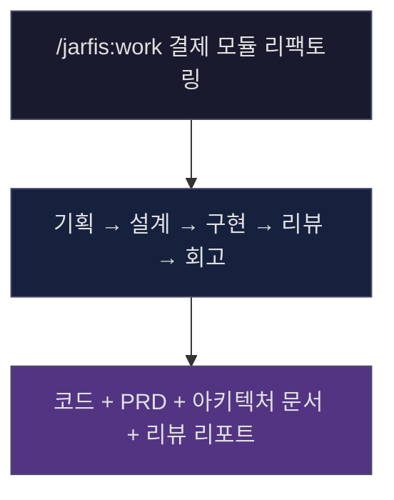
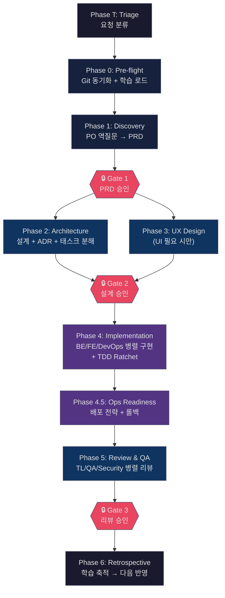
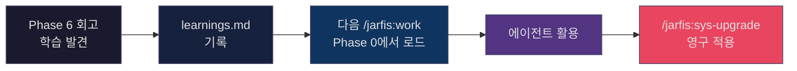

<p align="center">
  <strong>JARFIS</strong><br>
  <em>Just A Rather Foolish Integration System</em>
</p>

<p align="center">
  완벽한 시스템은 아닙니다.<br>
  더 나은 시스템이 되는 방향을 지향합니다.<br>
  명령어 한번에 IT 팀을 움직일 수 있는, 누구나를 위한 IT 팀 오케스트레이션
</p>

<p align="center">
  <sub>직접 써보면서 만들었고, 지금도 사용하면서 개선중입니다<br />by sanhalee</sub>
</p>

<p align="center">
  <a href="#quick-start">Quick Start</a> •
  <a href="#what-jarfis-does">What It Does</a> •
  <a href="#core-concepts">Core Concepts</a> •
  <a href="#workflow">Workflow</a> •
  <a href="#commands">Commands</a> •
  <a href="./PHILOSOPHY.md">Philosophy</a>
</p>

---

## Quick Start

```bash
git clone https://github.com/sana-lazystar/jarfis.git ~/repos/jarfis
cd ~/repos/jarfis
bash install.sh
```

Claude Code를 열고:

```
/jarfis:work 게시판 CRUD + 댓글 기능 구현
```

JARFIS가 기획부터 구현, 리뷰까지 전체 워크플로우를 오케스트레이션하고, 더 나은 오케스트레이션을 위해 기록합니다.

---

## What JARFIS Does

Claude Code에 슬래시 명령어 하나를 치면, 진짜 IT 팀이 일하는 것과 같은 일이 벌어집니다.

PO가 "이거 정말 필요한 거 맞아?" 하고 역질문을 쏟아내고, Architect가 "기존 시스템에 이렇게 얹으면 됩니다" 하고 설계를 그리고, Tech Lead가 태스크를 쪼개서 나누면, BE/FE/DevOps 엔지니어가 각자 구현에 들어갑니다. 다 끝나면 QA와 Security가 엄격한 리뷰를 해서 탄탄하게 만들고, 마지막으로 회고에서 "다음엔 이렇게 하자"를 기록합니다.

이게 전부 **하나의 명령어 안에서** 일어납니다.



대부분의 Claude Code 확장 도구는 개별 명령어 모음이나 에이전트 컬렉션입니다. JARFIS는 그것들을 **하나의 파이프라인으로 엮어서**, 기획 요청이 들어오면 완성된 코드와 문서가 나오게 만드는 시스템입니다.

---

## Core Concepts

### Agent = Persona + Skills + Rules

JARFIS v3.0의 에이전트는 세 요소로 동적 합성됩니다:

| 요소 | 역할 | 예시 |
|------|------|------|
| **Persona** | 역할별 인지 프레임워크 (~1500 토큰) | `product-owner` — 비즈니스 가치, JTBD, 스코프 판단 |
| **Skills** | 기술 전문성 (가변, 예산 2500 토큰) | `react`, `nodejs`, `tauri-backend` |
| **Rules** | 학습 + 프로젝트 맥락 | `jarfis-learnings.md`, `project-context.md` |

Persona는 **어떤 관점으로 사고하는가**를, Skills는 **어떤 기술을 아는가**를, Rules는 **이 프로젝트에서 무엇을 기억하는가**를 결정합니다. 이 세 요소가 Phase마다 조합되어 에이전트가 만들어집니다.

### Domain Pack

프로젝트의 기술 스택에 따라 에이전트에게 다른 Skills가 부여됩니다:

| Domain | Skills | 자동 감지 |
|--------|--------|-----------|
| **Web** | react, vue, browser, nodejs, express, biome-lint | `package.json`, `tsconfig.json` |
| **Desktop (Tauri)** | rust, tauri-backend, tauri-webview, cargo-clippy | `tauri.conf.json`, `Cargo.toml` |

Domain은 프로젝트 루트의 파일(`package.json`, `tauri.conf.json` 등)을 기반으로 자동 감지됩니다. 각 Domain Pack은 `_schema.yaml` 규격을 따르며, Skills 디렉토리에 기술별 전문 프롬프트가 분리되어 있습니다.

---

## Workflow

### The Full Pipeline



각 Phase에서 9개의 전문 에이전트가 자기 역할에 맞게 투입됩니다:

| Agent | Role |
|-------|------|
| Product Owner | 역질문으로 요구사항 정제, Working Backwards PRD |
| Technical Architect | 실현가능성 검증, 시스템 설계, ADR |
| Tech Lead | 태스크 분해, 코드 리뷰 |
| Backend Engineer | 서버 구현 |
| Frontend Engineer | 클라이언트 구현 |
| DevOps/SRE Engineer | 인프라, CI/CD, 배포 |
| QA Engineer | 테스트 전략, 품질 검증 |
| Security Engineer | 보안 리뷰 |
| UX Designer | 화면 설계 |

### 3가지 모드

| 모드 | 명령어 | 용도 |
|------|--------|------|
| **Full Workflow** | `/jarfis:work` | 기획부터 회고까지 전체 파이프라인 |
| **Meeting** | `/jarfis:work-meeting` | 코딩 전 기획 토론 (PO/TL 자유 토론 → 산출물) |
| **Continue** | `/jarfis:work-continue` | 완료된 워크플로우 후속 작업 (Fix/Extend) |

Meeting 모드에서 PO와 Tech Lead가 자유 토론을 벌이고, 필요하면 전문가(Security, DevOps 등)를 소환합니다. 토론 결과는 회의록 + 의사결정표 + 기술 조사 보고서로 정리되며, 나중에 `/jarfis:work`를 실행하면 이 미팅 결과를 자동으로 감지하여 활용합니다.

---

## Artifacts

하나의 워크플로우가 만들어내는 산출물:

```
.personal/orgs/{org}/works/20260311-feat-결제-리팩토링/
├── .jarfis-state.json       # 워크플로우 상태 (중단 시 재개용)
├── press-release.md          # Working Backwards 프레스 릴리스
├── prd.md                    # 요구사항 정의서
├── impact-analysis.md        # 기존 코드 영향 분석
├── architecture.md           # 아키텍처 설계 + ADR
├── api-spec.md               # API 명세 (BE-FE 계약)
├── tasks.md                  # 태스크 분해표
├── test-strategy.md          # 테스트 전략
├── ux-spec.md                # UX 설계 (UI 있는 경우)
├── deployment-plan.md        # 배포 전략 + 롤백
├── review.md                 # TL/QA/Security 리뷰
└── retrospective.md          # 회고 + 학습
```

모든 산출물이 날짜 + 작업명으로 정리되어, 프로젝트의 의사결정 기록이 자연스럽게 쌓입니다.

---

## Key Features

### Learning System

JARFIS는 **매 워크플로우에서 학습하고, 다음 워크플로우에 적용**합니다.



**두 가지 레벨의 학습**:

- **전역 학습** (`$JARFIS_ORG_DIR/learnings.md`): 모든 프로젝트에 적용되는 에이전트 힌트 + 워크플로우 패턴
- **프로젝트 학습** (`project-context.md`): 특정 코드베이스에 대한 맥락 (컨벤션, 기술 스택, 히스토리)

### Context Resilience

Claude Code의 auto-compact로 컨텍스트가 압축되어도 워크플로우가 끊기지 않습니다.

- **`.jarfis-state.json`**: 현재 Phase, 완료된 태스크, 체크포인트를 실시간 기록
- **4개 Hook 인프라**:
  - **PreCompact**: auto-compact 직전에 워크플로우 상태를 자동 백업
  - **Safety (PreToolUse)**: 위험한 Bash 명령어 사전 차단
  - **Quality Gate (PostToolUse)**: Edit/Write 후 코드 품질 자동 검증
  - **Session Start**: 세션 시작 시 이전 컨텍스트 자동 복원
- **Phase 4 자동 커밋**: 구현 중 태스크 완료 시마다 `jarfis(BE-1):`, `jarfis(FE-2):` 형식으로 커밋
- **Resume**: 컨텍스트 유실 시 상태 파일에서 복원하여 중단 지점부터 재개

### Self-Evolution

JARFIS는 자기 자신을 개선하는 도구를 내장하고 있습니다.

| Command | What it does |
|---------|-------------|
| `/jarfis:sys-upgrade` | 축적된 학습을 에이전트 프롬프트에 영구 반영 |
| `/jarfis:sys-distill` | 프롬프트 토큰 효율을 측정하고 최적화 (중복 제거, 템플릿 외부화) |
| `/jarfis:sys-implement` | JARFIS 자체의 명령어/구조를 수정 |

프롬프트를 사용할수록 학습이 쌓이고, 학습이 프롬프트에 반영되고, 프롬프트가 다시 최적화됩니다.

### Wiki Semantic Search

Organization 레벨의 Wiki가 커질수록, "어떤 파일이 지금 기획과 관련 있는가?"를 정확하게 찾는 것이 중요해집니다.

JARFIS는 [sentence-transformers](https://sbert.net/)의 **BAAI/bge-m3** 모델을 사용하여 Wiki 문서를 임베딩하고, 코사인 유사도(score >= 0.5) 기반 시맨틱 검색을 제공합니다. 한국어와 영어가 혼용된 마크다운 문서에서도 의미 기반으로 관련 문서를 찾아냅니다.

```
/jarfis:work 결제 환불 정책 변경
  → Phase 0: Wiki 시맨틱 검색 → "refund", "payment cancellation" 관련 ADR 3건 자동 로드
  → Phase 1: PO가 기존 환불 정책 ADR을 참조하여 역질문
```

자세한 내용: **[WIKI_SEARCH.md](./WIKI_SEARCH.md)**

### Project Awareness

JARFIS는 프로젝트의 컨텍스트를 이해하고 활용합니다.

```
/jarfis:project-init
```

프로젝트의 기술 스택, 디렉토리 구조, 코딩 컨벤션, 배포 환경을 분석하여 프로필을 생성합니다. 이후 워크플로우에서 에이전트들이 이 프로필을 참조하여 프로젝트에 맞는 결정을 내립니다.

```
/jarfis:project-update
```

`git diff` 기반으로 변경된 부분만 증분 갱신합니다.

---

<!-- JARFIS-COMMANDS-START -->
## Commands

| Command                   | Description                                                                                 |
| ------------------------- | ------------------------------------------------------------------------------------------- |
| `/jarfis`                 | Display command list                                                                        |
| `/jarfis:work-meeting`    | Planning kickoff meeting (PO/TL open discussion -> artifact generation)                     |
| `/jarfis:work`            | Full workflow: planning -> design -> implementation -> review                               |
| `/jarfis:project-init`    | Project analysis -> generate `./.jarfis/project-profile.md`                                 |
| `/jarfis:project-update`  | Incremental profile update (commit hash-based, date fallback)                               |
| `/jarfis:sys-upgrade`     | Learning item CRUD + apply to agent/workflow prompts                                        |
| `/jarfis:sys-health`      | Zombie Claude process diagnosis/cleanup                                                     |
| `/jarfis:sys-distill`     | Prompt distillation — token efficiency analysis/optimization                                |
| `/jarfis:work-continue`   | Follow-up on completed workflows (Fix/Extend mode, --workflow/--mode flags)                 |
| `/jarfis:org`             | Full registered Org list (orgs.json based, CWD highlight)                                   |
| `/jarfis:org-init`        | Organization initialization (scan + wiki creation)                                          |
| `/jarfis:wiki-storyboard` | Design catalog browsing (wiki/DESIGN -> browser)                                            |
| `/jarfis:search-setup`    | Semantic search installation (venv + sentence-transformers one-step)                        |
| `/jarfis:search`          | Semantic unified search (meetings+works+wiki, filterable)                                   |
| `/jarfis:search-index`    | Full Org semantic index batch creation/refresh (wiki+meetings+works)                        |
| `/jarfis:level-check`     | AI-native developer maturity assessment (auto-collection + interview, 7-dimension 10-point) |
| `/jarfis:locale`          | View current locale setting                                                                 |
| `/jarfis:locale-set`      | Change locale setting (ko/en/ja)                                                            |
| `/jarfis:sys-implement`   | JARFIS system self-modification/feature addition + version bump                             |
| `/jarfis:sys-version`     | Version check/update/install specific version                                               |
<!-- JARFIS-COMMANDS-END -->

---

## Installation

### Requirements

| Dependency | Version | Purpose | Required |
|------------|---------|---------|----------|
| [Claude Code](https://claude.ai/code) | Latest | CLI 런타임 | **필수** |
| Git | 2.x+ | 브랜치 관리, 자동 커밋 | **필수** |
| Python | 3.9+ | 상태 관리, CLI, Hook 인프라 | **필수** |
| jq | Any | Hook 등록 자동화 | 선택 |
| [sentence-transformers](https://sbert.net/) | Any | Wiki Semantic Search (bge-m3) | 선택 |

> **sentence-transformers**는 [Wiki Semantic Search](./WIKI_SEARCH.md) 기능을 위한 선택적 의존성입니다.
> 미설치 시에도 JARFIS는 정상 작동하며, Wiki 로딩 시 기존 LLM 판단 방식으로 폴백합니다.
> 설치: `pip3 install sentence-transformers`

### Install

```bash
git clone https://github.com/sana-lazystar/jarfis.git ~/repos/jarfis
cd ~/repos/jarfis
bash install.sh
```

`install.sh`는 다음을 수행합니다:

1. 기존 설치 백업
2. 에이전트의 Learned Rules 추출 (학습 보존)
3. `commands/`, `agents/`, `hooks/`, `scripts/` → `~/.claude/`로 파일 설치
4. `.personal/` 개인 설정 적용
5. 추출한 Learned Rules 재적용
6. 4개 Hook 등록 (settings.json): PreCompact, PreToolUse(Safety), PostToolUse(Quality Gate), SessionStart
7. 버전 스탬프 기록

### Data Directory

런타임 데이터는 repo 내 `.personal/` 디렉토리에 저장됩니다 (`.gitignore`에 의해 추적 제외):

```
~/repos/jarfis/.personal/
├── orgs/
│   ├── {org-name}/
│   │   ├── works/        # 워크플로우 산출물
│   │   ├── meetings/     # 미팅 산출물
│   │   └── learnings.md  # 학습 항목
│   └── _standalone/      # Org 미등록 시 기본
│       ├── works/
│       ├── meetings/
│       └── learnings.md
└── orgs.json              # Org 레지스트리
```

### Update

```bash
cd ~/repos/jarfis && git pull && bash install.sh
```

또는 Claude Code 안에서:

```
/jarfis:sys-version
```

### Install Specific Version

```bash
bash install.sh --version 1.0.0
```

---

<!-- JARFIS-ARCHITECTURE-START -->
## Architecture

```
~/.claude/commands/
├── jarfis.md                      # Main helper — command list + examples A/B
└── jarfis/
    ├── jarfis-index.md            # This file — JARFIS system overview
    ├── sys-implement.md               # JARFIS self-modification command + Dialectic Review ratchet convergence (analyze→verify→history→improve loop) + Python TDD rules
    ├── work-meeting.md                 # Planning kickoff meeting + wiki loading + --prev-meeting previous meeting reference (PO/TL discussion, 230 lines)
    ├── work.md                    # Core: workflow orchestration (~830 lines, v2.5.4: PRD Ratchet, v2.5.5: Workflow Metrics, v2.5.6: TDD Code Ratchet, v3.0: Domain branching)
    ├── project-init.md            # Project profile creation
    ├── project-update.md          # Incremental profile update — commit hash-based change detection
    ├── sys-upgrade.md                 # Learning item management + 3-block independent structure + Dialectic Review + agent whitelist protection
    ├── sys-distill.md                 # Prompt distillation + agent whitelist protection + command analysis only + Dialectic Review
    ├── sys-version.md                 # Version management/updates
    ├── work-continue.md                # Follow-up on completed workflows — Fix/Extend + Fix test ratchet + wiki 2/4-Step + Workflow Metrics
    ├── org.md                     # Full organization list — orgs.json based + unregistered Org auto-discovery + CWD highlight
    ├── org-init.md                # Organization initialization — scan + wiki creation + semantic index guide
    ├── wiki-storyboard.md              # Design catalog browsing command
    ├── search.md                 # Semantic unified search — meetings/works/wiki filtering + low-memory LLM fallback
    ├── search-setup.md     # Semantic search installation — venv + sentence-transformers one-step
    ├── search-index.md    # Full Org semantic index batch creation/refresh — wiki+meetings+works + --current + memory guard
    ├── level-check.md                 # AI-native developer maturity assessment — level_check.py auto-collection + interview, 7-dimension 10-point
    ├── sys-health.md                  # Zombie process diagnosis
    ├── locale.md                      # Locale query — display current workflow language setting
    ├── locale-set.md                  # Locale setting — change language to ko/en/ja
    ├── prompts/                   # Externalized agent prompts (generated by distill)
    │   ├── phase1.md              # Phase 1 Discovery prompt + PO wiki reference + additional tasks + $MEETING_EXTRA injection + PRD Ratchet rules
    │   ├── phase2.md              # Phase 2&3 Architecture/UX prompt + wiki reference + HTML mockup
    │   ├── phase3-figma.md       # Phase 3 Figma-Driven Design Path prompt (parallel multi-Figma page processing, per-section v5 generation, Step 3-F0~3-F4)
    │   ├── phase4.md              # Phase 4 Implementation prompt + TDD Step 4-0.5 + Ratchet + TEST_RESULT/TEST_MODIFIED reporting
    │   ├── phase4-5.md            # Phase 4.5 Operational Readiness + dev server check
    │   ├── phase5.md              # Phase 5 Review & QA + Phase 4 Agent Status injection + TDD lightweight + test_modifications validation + Fix original design reference + UX Designer dual comparison
    │   ├── phase6.md              # Phase 6 Retrospective + Workflow Metrics + wiki 2-track update + semantic index refresh
    │   ├── wiki-loading.md        # Wiki loading shared module — 2-Step/4-Step + semantic search
    │   └── continue-extend.md    # Continue Extend mode PO/Architect/TL/QA prompt
    ├── domains/                   # v3.0 Domain Pack infrastructure
    │   ├── _schema.yaml           # Domain Pack specification (Published Language, EP1-7)
    │   ├── web.yaml               # Web Development domain pack
    │   ├── web/skills/            # Web domain Skills
    │   │   ├── react.md           # React patterns + state management + Next.js
    │   │   ├── vue.md             # Vue 3 Composition API + Pinia + Nuxt
    │   │   ├── browser.md         # Cross-browser + performance + mobile
    │   │   ├── nodejs.md          # Node.js runtime + TypeScript + DB
    │   │   ├── express.md         # Express/NestJS + API design
    │   │   └── biome-lint.md      # Biome linting/formatting patterns
    │   ├── desktop.yaml           # Desktop Development (Tauri) domain pack
    │   └── desktop/skills/        # Desktop domain Skills
    │       ├── rust.md            # Ownership/borrowing, error handling, async
    │       ├── tauri-backend.md   # #[tauri::command], IPC, serde, plugins
    │       ├── tauri-webview.md   # @tauri-apps/api, invoke(), events, WebView constraints
    │       └── cargo-clippy.md    # Clippy rules, deny configuration
    └── templates/                 # Externalized artifact templates (generated by distill)
        ├── jarfis-state-schema.md # .jarfis-state.json structure schema + PRD ratchet + Phase 4 TDD ratchet + Fix ratchet + workflow-metrics.tsv
        ├── learnings.md           # jarfis-learnings.md template — Universal/Project-Specific structure
        ├── project-context.md     # project-context.md template
        ├── project-profile.md     # Project profile template + org back-reference
        ├── meeting-artifacts.md   # Meeting artifact 4-type templates
        ├── org-profile.md         # Organization profile template
        ├── wiki-index.md          # Wiki INDEX.md initial template
        ├── wiki-section-index.md  # Wiki section _index.md template
        ├── ux-direction.md        # UX direction document template
        └── design-html-meta.md    # HTML mockup meta comment template

~/.claude/agents/jarfis/           # JARFIS agent prompts (referenced by work.md) — ALL ENGLISH + $LOCALE output
├── personas/                      # v3.0 Persona — role-specific cognitive frameworks
│   ├── product-owner.md           # PO perspective (business value, JTBD)
│   ├── technical-architect.md     # Architect perspective (system design, trade-offs)
│   ├── tech-lead.md               # TL perspective (code quality, technical judgment)
│   ├── frontend-developer.md      # FE perspective (browser/UI, design fidelity)
│   ├── backend-developer.md       # BE perspective (systems thinking, DB, API)
│   ├── devops-engineer.md         # DevOps perspective (infra, reliability, cost)
│   ├── ux-designer.md             # UX perspective (user empathy, visual hierarchy)
│   ├── qa-engineer.md             # QA perspective (quality, risk, compatibility)
│   └── security-engineer.md       # Security perspective (threat modeling, defensive coding)
├── jarfis-advocate.md             # Dialectic Review — change advocate agent
├── jarfis-critic.md               # Dialectic Review — change critic agent
├── senior-backend-engineer.md     # BE implementation agent
├── senior-frontend-engineer.md    # FE implementation agent
├── senior-devops-sre-engineer.md  # DevOps implementation agent
├── senior-product-owner.md        # PO decision-making / PRD / UX direction agent
├── tech-lead.md                   # TL codebase health + technical judgment agent
├── technical-architect.md         # Architecture design + technical strategy agent
├── senior-security-engineer.md    # Security review + defensive coding verification agent
├── senior-qa-engineer.md          # QA review + risk assessment agent
└── senior-ux-designer.md          # UX/brand design + SVG assets + quality gate + Figma rules agent
```

**Design Principles**:

- **Workflow flow** in `work.md`, **agent prompts** in `prompts/`, **output templates** in `templates/` — separated
- Agent role prompts (`agents/`) and workflow prompts (`prompts/`) are separate — roles are fixed, tasks vary per Phase
- Learning data exists only locally (not included in Git repo)
<!-- JARFIS-ARCHITECTURE-END -->

---

## Versioning

Semantic Versioning을 따릅니다.

| Change | Bump |
|--------|------|
| 프롬프트/템플릿 수정 | PATCH |
| 새 명령어/에이전트 추가 | MINOR |
| Phase 구조 변경 | MAJOR |

`/jarfis:sys-implement`, `/jarfis:sys-upgrade`, `/jarfis:sys-distill` 실행 시 자동으로 버전이 범프되고 CHANGELOG에 기록됩니다.

---

<!-- JARFIS-LATEST-CHANGES-START -->
## Latest Changes

> See [CHANGELOG.md](./CHANGELOG.md) for full change history.

## [3.6.1] - 2026-04-14

- implement: Phase 2 — remove $LEARNINGS runtime loading from all prompts
<!-- JARFIS-LATEST-CHANGES-END -->

---

## License

[AGPL-3.0](./LICENSE)
