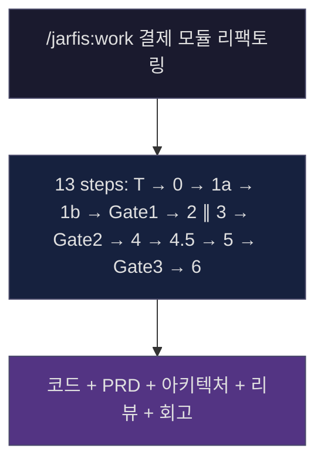
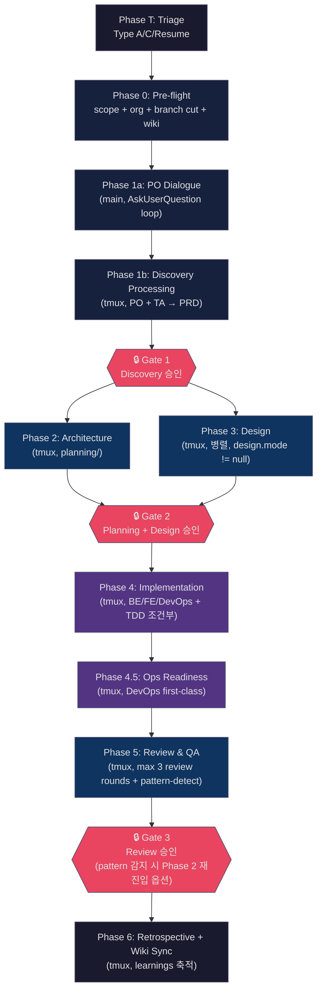
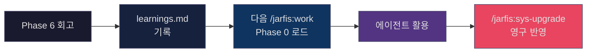

<p align="center">
  <strong>JARFIS</strong><br>
  <em>Just A Rather Foolish Integration System</em>
</p>

<p align="center">
  <strong>Depth-first AI workflow orchestration — deterministic gate · tmux-per-phase · design traceability</strong>
</p>

<p align="center">
  <sub><em>Last aligned: v4.0.5 · 2026-04-20 · by sanhalee</em></sub>
</p>

<p align="center">
  <a href="#quick-start">Quick Start</a> •
  <a href="#what-jarfis-does">What It Does</a> •
  <a href="#core-concepts">Core Concepts</a> •
  <a href="#workflow">Workflow</a> •
  <a href="#commands">Commands</a> •
  <a href="#depth-first-positioning">Depth-first</a> •
  <a href="#limitations">Limitations</a> •
  <a href="./PHILOSOPHY.md">Philosophy</a>
</p>

---

> **"JARFIS v4는 기능적으로 v3보다 분명히 전진했고, 특히 deterministic verification 전환이 크다. 지금의 가장 큰 약점은 시스템 자체보다, 그 전진을 철학·설계 문서가 아직 제대로 선언하지 못하고 있다는 점이다."**
>
> <sub>— 외부 평가 3라운드 공통 결론 (ChatGPT + Claude, 2026-04-19)</sub>

JARFIS는 *'AI를 도구로 쓰는 법'* 이 아니라 *'**AI 주변에 신뢰 가능한 실행 모델을 설계하는 일**'* 이다. 프론트엔드 엔지니어링 6년에서 가져온 시스템 사고 — 흐름을 명확히 모델링하고, 상태 전이를 다루고, 모호함을 줄이고, 복잡한 상호작용을 일관된 제품 동작으로 수렴시키는 작업 — 을 **개발 워크플로우 자체에 적용한 결과** 다.

---

## Quick Start

```bash
git clone https://github.com/sana-lazystar/jarfis.git ~/repos/jarfis
cd ~/repos/jarfis
bash install.sh
```

Claude Code를 열고:

```
/jarfis:work 게시판 CRUD + 댓글 기능 구현
```

JARFIS가 13단계 워크플로우(Triage → Pre-flight → Discovery → Architecture ∥ Design → Implementation → Ops Readiness → Review → Retrospective) 를 순회하며 코드 · PRD · 아키텍처 문서 · 리뷰 리포트를 만들어낸다. 중간에 3개 Gate에서 사용자 승인을 받는다.

---

## What JARFIS Does

Claude Code에 슬래시 명령어 하나로 **deterministic workflow engine** 이 기동된다.



**구체적으로 무엇이 일어나는가**:

1. **Phase T (Triage)** — 요청을 분류. "단순 질문" 이면 바로 답변하고 종료 (over-engineering 방지)
2. **Phase 0 (Pre-flight)** — 워크스페이스 scope, Git branch cut, 도메인 자동 감지, Wiki 로드
3. **Phase 1a (PO Dialogue, main)** — PO 페르소나가 역질문. 사용자가 직접 답변
4. **Phase 1b (Discovery Processing, tmux)** — PO/TA 합동 PRD 작성
5. **Gate 1** — 사용자 승인
6. **Phase 2 ∥ 3 (Architecture ∥ Design, two tmux sessions)** — 아키텍처 + UX 병렬 설계
7. **Gate 2** — 사용자 승인
8. **Phase 4 (Implementation, tmux)** — BE/FE/DevOps 에이전트가 각 scope 구현
9. **Phase 4.5 (Operational Readiness, tmux)** — DevOps가 배포 runbook + 롤백 계획
10. **Phase 5 (Review & QA, tmux)** — TL/QA/Security 리뷰 (최대 3 round 내부 pattern-detect)
11. **Gate 3** — 사용자 승인 (병적 패턴 감지 시 Phase 2 복귀 옵션 제시)
12. **Phase 6 (Retrospective + Wiki Sync, tmux)** — 회고 + learnings 축적

각 Phase 사이는 **deterministic gate** (Python, ~10ms) 가 산출물을 검증한다. LLM 판정이 아니라 파일 존재 / 스키마 / 필수 필드 검사. [DESIGN.md ADR-15](./DESIGN.md#adr-15) 참조.

대부분의 AI workflow 도구는 개별 명령어 모음이나 agent collection이다. JARFIS는 그것들을 **하나의 state machine으로 엮어서** 기획 요청이 들어오면 완성된 코드 + 문서가 나오는 **depth-first orchestration** 이다.

---

## Core Concepts

### Agent = Persona + Skills + Rules

에이전트는 **결정적 합성** (LLM inference 없음, YAML 선언) 으로 조립된다 (DESIGN [ADR-1](./DESIGN.md#adr-1), [ADR-17](./DESIGN.md#adr-17)).

| 요소 | 역할 | 예시 |
|------|------|------|
| **Persona** | 역할별 인지 프레임 | `product-owner`, `technical-architect`, `backend-developer` (9개 총) |
| **Skills** | 기술 전문성 (300 토큰/개, 합산 2500 예산) | `react`, `nodejs`, `rust`, `aws-lambda` (16개 총) |
| **Rules** | 프로젝트별 학습 + 전역 learnings | `.jarfis-project/project-*.md`, `~/.claude/learnings.md` |

- **Persona** = 어떤 관점으로 사고하는가
- **Skills** = 어떤 기술을 아는가
- **Rules** = 이 프로젝트에서 무엇을 기억하는가

자세한 체계: [AGENTS.md](./AGENTS.md).

### tmux-per-phase Orchestration (v4 신규)

Phase 1b ~ 6 각각이 **독립 tmux 세션**에서 실행된다 (DESIGN [ADR-16](./DESIGN.md#adr-16)):

- 세션명: `{sessionKey}-phase{N}` (예: `jf-a1b2c3d4-phase3`)
- 메인 세션은 T/0/1a + 3개 Gate만 담당
- Phase 2 ∥ 3 은 두 tmux 세션으로 **절대 병렬 실행** (B1 isolation: exact-name match only)

**정량 효과**: 메인 세션 컨텍스트가 v3 ~100,000 tokens → v4 ~11,000 tokens (~89% 감소).

### Deterministic Gate — `verify.py` (v4 신규)

v3에서 Phase 검증은 `jarfis-black` LLM sub-agent였다 (~1,400 tokens, non-deterministic). v4에서는 `verify.py` (Python, 1,349 lines):

- 실행 시간: ~10ms (vs LLM ~2-5초, 300x)
- 토큰 비용: 0 (vs ~1,400)
- 출력: JSON machine-verifiable (vs LLM prose)
- 4개 엔트리: `gate-check` · `phase-check` · `phase-verify` · `pattern-detect`

[DESIGN ADR-15](./DESIGN.md#adr-15).

### Single-writer State (v4 신규)

동시성 경합을 **파일 경로 단위로 원천 차단** (DESIGN [ADR-18](./DESIGN.md#adr-18)):

- `.jarfis-state.json` — Main session 전용 쓰기
- `phase-results/phase{N}/attempt{K}.json` — tmux sub-agent 전용 쓰기
- Lock 없이 안전성 보장

### JARFIS_TRACE — Opt-in Observability (v4.0.5)

구조화 span 데이터를 opt-in으로 수집 (DESIGN [ADR-20](./DESIGN.md#adr-20)):

```bash
export JARFIS_TRACE=1   # 활성
export JARFIS_TRACE=0   # 비활성 (기본)
```

- default off 시 overhead ~0.008% (사실상 측정 불가)
- on 시 overhead < 20% (postflight enforce)
- 3개 hot path 계측: `tmux_claude.py` · `verify.cmd_phase_verify` · `compose/__main__`

---

## Workflow

### 13-step Pipeline



**실행 경계**: Direct (main) = T, 0, 1a, Gate 1/2/3 · tmux (foreman) = 1b, 2, 3, 4, 4.5, 5, 6

자세한 내용: [WORKFLOW.md](./WORKFLOW.md).

### 두 실행 모드

| 모드 | 명령어 | 용도 |
|------|--------|------|
| **Full Workflow** | `/jarfis:work` | 13단계 전체 파이프라인 |
| **Meeting** | `/jarfis:work-meeting` | 코딩 전 기획 토론 (PO/TL 자유 토론 → 산출물) |

Meeting 모드는 PO와 Tech Lead가 자유 토론하며 필요 시 전문가(Security, DevOps 등)를 소환한다. 결과(회의록 + 의사결정표 + 기술 조사) 는 다음 `/jarfis:work` 실행 시 Phase 0에서 자동 감지되어 활용된다.

---

## Artifacts

한 번의 워크플로우가 만들어내는 산출물:

```
{docsDir}/
├── .jarfis-state.json           # state (main 전용 쓰기)
├── .wiki-cache.md               # Phase 0 wiki 로드 결과
│
├── discovery/                   # Phase 1b
│   ├── prd.md · working-backwards.md · ux-direction.md · po-qa.json
│
├── planning/                    # Phase 2
│   ├── architecture.md · tasks.md · test-strategy.md · api-spec.md
│
├── design/                      # Phase 3
│   ├── token-map.json · {page}/index.html · reference*.png
│
├── ops/                         # Phase 4 + Phase 4.5
│   ├── infra-runbook.md · deployment-plan.md
│
├── review/                      # Phase 5
│   ├── review.md · api-contract-check.md · diagnosis-*.md
│
├── retrospective.md             # Phase 6
│
└── phase-results/phase{N}/attempt{K}.json   # tmux sub-agent 결과 (sub 전용 쓰기)
```

모든 산출물이 `{docsDir}` 하위에 정리되어, **워크플로우 단위로 의사결정 기록이 자연 축적**된다.

---

## Key Features

### Learning System (#3 Dogfooding Evolution)

매 워크플로우가 학습 데이터가 된다 (PHILOSOPHY [#3](./PHILOSOPHY.md#3-dogfooding-evolution)).



- **전역 학습**: `~/.claude/learnings.md` — 모든 프로젝트에 적용
- **프로젝트 학습**: `.jarfis-project/project-context.md` — 특정 코드베이스 맥락

### Context Resilience (#4 Resilient Continuity)

Claude Code의 auto-compact · 크래시 · 수동 종료에도 워크플로우가 이어진다 ([PHILOSOPHY #4](./PHILOSOPHY.md#4-resilient-continuity)).

- **`.jarfis-state.json`**: 현재 Phase, 완료된 태스크, 체크포인트 실시간 기록
- **4개 Hook**:
  - **PreCompact**: auto-compact 직전 state 백업 (최근 10개 rotation)
  - **Safety (PreToolUse)**: 위험한 Bash 명령 차단 (`git push --force`, `--no-verify`, main 직접 commit)
  - **Quality Gate (PostToolUse)**: Edit/Write 후 lint/typecheck 경고 (차단 안 함)
  - **Session Start**: 세션 시작 시 미완료 워크플로우 컨텍스트 자동 주입
- **`--save-pane`** (v4.0.4): tmux 세션 종료 직전 scrollback 캡처 (post-mortem)
- **Phase 4 자동 커밋**: `jarfis(BE-1):`, `jarfis(FE-2):` 형식으로 태스크별 커밋

자세한 내용: [INFRASTRUCTURE.md](./INFRASTRUCTURE.md).

### Self-Evolution (#2 Dialectic for Self-Modification)

JARFIS는 자기 자신을 개선하는 도구를 내장한다 ([PHILOSOPHY #2](./PHILOSOPHY.md#2-dialectic-for-self-modification)).

| Command | What it does |
|---------|-------------|
| `/jarfis:sys-upgrade` | 축적된 learnings를 에이전트 프롬프트에 영구 반영 |
| `/jarfis:sys-distill` | 프롬프트 토큰 효율 측정 + 최적화 (중복 제거, 템플릿 외부화) |
| `/jarfis:sys-implement` | JARFIS 자체의 명령어/구조 수정 |

**Dialectic Review**: `sys-*` 3종은 Advocate(green) + Critic(red) 2인 토론(라운드당 300단어, 최대 2라운드)으로 맹점 검출. 일반 `/jarfis:work` 에는 적용되지 않음 (범위 명시, [DESIGN ADR-13](./DESIGN.md#adr-13)).

### Wiki Semantic Search

Organization 레벨 wiki가 커지면 *"어떤 파일이 지금 기획과 관련 있는가?"* 가 중요해진다.

JARFIS는 [sentence-transformers](https://sbert.net/) 의 **BAAI/bge-m3** 모델로 wiki 문서를 임베딩하고, cosine 유사도 (score ≥ 0.5) 기반 시맨틱 검색을 제공한다. 한/영 혼용 마크다운에서 의미 기반 검색 가능.

```
/jarfis:work 결제 환불 정책 변경
  → Phase 0: Wiki 시맨틱 검색 → "refund", "payment cancellation" 관련 ADR 3건 자동 로드
  → Phase 1a: PO가 기존 ADR 참조하여 역질문
```

자세한 내용: [WIKI_SEARCH.md](./WIKI_SEARCH.md).

### Project Awareness

```
/jarfis:project-init
```

프로젝트의 기술 스택 / 디렉토리 구조 / 코딩 컨벤션 / 배포 환경 분석 → `.jarfis-project/project-profile.md` 생성. 이후 모든 워크플로우에서 에이전트가 이 프로필을 참조한다.

```
/jarfis:project-update
```

`git diff` 기반 증분 갱신.

---

<a id="depth-first-positioning"></a>
## Depth-first Positioning

JARFIS와 다른 AI workflow 도구들의 설계 차이를 정량으로 비교 (internal benchmark 기준, 14축 rubric v2):

| 시나리오 | JARFIS | 비교 대상 (범용 플랫폼) | 해석 |
|---------|:------:|:---------------------:|------|
| Unweighted baseline (14축 동일 가중치) | **82.5** | 82.1 | 사실상 동점 |
| Depth-first weighting (workflow/determinism/traceability 가중) | **85.5** | 80.7 | JARFIS 우세 |
| Breadth-first weighting (ecosystem/interop 가중) | 79.8 | **83.3** | 비교 대상 우세 |

<sub>Internal benchmark — 공개 표준 아님. rubric 출처 / 재현 방법은 내부 문서. 점수는 2026-04-19 기준 3라운드 외부 평가 (ChatGPT + Claude) 로 보정됨.</sub>

### JARFIS의 유일한 clear lead

14축 중 JARFIS가 비교 대상을 명확히 앞선 축은 **단 하나**:

**축 12 — Design Traceability (JARFIS 8.5 vs 비교 대상 7.0)**

철학 → ADR → 구현 → 테스트로 이어지는 추적 가능성. 구체적으로:
- PHILOSOPHY `#1` → DESIGN [ADR-15 verify.py](./DESIGN.md#adr-15) → `scripts/jarfis/verify.py:789-1285` → `tests/test_verify.py`
- phase prompts에 `#{N}` 참조 명시 → 철학이 실행 경로에 살아있다는 증거

**이 축이 문서 refresh (PHILOSOPHY v2 + DESIGN v2 + MIGRATION) 의 보호 대상**.

### 정체성 선언

> **"JARFIS는 범용 플랫폼이 아니다. 서로 다른 축에서 최적화된 AI-Native 설계의 두 경로 중 depth-first 쪽이다."**

**Depth-first** = deterministic gate · workflow state machine · design traceability · phase orchestration
**Breadth-first** = ecosystem · plugin marketplace · multi-provider interop

JARFIS는 한 사람이 "workflow를 완전히 이해하고 통제"하는 도구를 지향. 범용 플랫폼으로 진화할 계획 없음.

---

<a id="limitations"></a>
## Limitations (정직 섹션)

v4는 아키텍처 성숙도가 상승했고, **운영 안정성은 정착 중**이다. (ChatGPT 3라운드 정제 표현)

### 1. UX 러닝커브

- Gate 3개 + Phase T AskUserQuestion + 20+ 슬래시 명령어 → 비전문가 entry barrier 존재
- 외부 평가 축 4 (Human Gate Balance) 7.5/10
- **완화 방안** (v4.1 후보): Autopilot 모드 — learnings 기반 default 자동 채택

### 2. tmux 운영 비용 (findings F-10)

- 워크플로우 비정상 종료 시 좀비 tmux 세션 발생 가능 → `/jarfis:sys-health` 로 수동 진단
- 디버깅이 main + 여러 tmux에 분산 → `--save-pane` (v4.0.4) + `JARFIS_TRACE` (v4.0.5) 로 완화 중
- tmux 의존 — Windows native 미지원 (WSL 권장)

자세한 내용: [INFRASTRUCTURE.md §9 Trade-offs](./INFRASTRUCTURE.md#tradeoffs).

### 3. 1인 dogfooding pool

- 단일 사용자 실행 패턴만으로 운영 안정성 검증 중
- 다양한 환경/사용 패턴에서의 회귀를 조기 포착 어려움
- **상태**: "아키텍처 성숙도 상승, 운영 안정성 정착 중"

### 4. workflow-metrics 대시보드 미완

- `workflow-metrics.tsv` 기록은 됨 (v2.5.5부터)
- 대시보드 / 자동 A/B 반영 루프 **없음** — 사람이 수동으로 tsv 분석
- **v4.1 후보** — PHILOSOPHY [#3 Aspiration path](./PHILOSOPHY.md#3-dogfooding-evolution)

### 5. Ratchet 실상

- "3종 Ratchet" 은 v3 표현. v4에서는 **TDD Ratchet (조건부 활성)** 만 살아있음. PRD 제거 (v4.0.1), Fix legacy. ([DESIGN ADR-21](./DESIGN.md#adr-21))

### 이원화 프레임

> **"설계는 진전, 운영은 정착 중."**

이 프레임을 문서 / 이력서 / 블로그 전반에 유지. over-claim 방지.

---

## Commands

실행 가능한 슬래시 명령어 (v4.0.5 기준).

### Workflow 핵심
| Command | Description |
|---------|-------------|
| `/jarfis:work` | 전체 워크플로우 (13 steps) — 기획부터 회고까지 |
| `/jarfis:work-meeting` | 코딩 전 기획 미팅 (PO/TL 자유 토론) |

### Self-modification (Dialectic Review 적용)
| Command | Description |
|---------|-------------|
| `/jarfis:sys-implement` | JARFIS 자체 구조 변경 |
| `/jarfis:sys-upgrade` | learnings 영구 반영 |
| `/jarfis:sys-distill` | 프롬프트 증류 (토큰 최적화) |

### Operational
| Command | Description |
|---------|-------------|
| `/jarfis:sys-health` | 좀비 Claude 프로세스 진단 |
| `/jarfis:sys-version` | 버전 확인 / 업데이트 / 특정 버전 설치 |

### Project / Organization
| Command | Description |
|---------|-------------|
| `/jarfis:project-init` | project-profile.md 생성 |
| `/jarfis:project-update` | 증분 프로필 갱신 (git diff 기반) |
| `/jarfis:org` | 등록된 Organization 목록 |
| `/jarfis:org-init` | Organization 초기화 (wiki 생성) |

### Search / Discovery
| Command | Description |
|---------|-------------|
| `/jarfis:search` | 시맨틱 통합 검색 (meetings + works + wiki) |
| `/jarfis:search-setup` | semantic search 설치 (venv + sentence-transformers) |
| `/jarfis:search-index` | 전체 Org 시맨틱 인덱스 생성/갱신 |
| `/jarfis:wiki-storyboard` | Design 카탈로그 브라우징 |

### Assessment / Locale
| Command | Description |
|---------|-------------|
| `/jarfis:level-check` | AI-Native Developer 성숙도 평가 (7차원 10점) |
| `/jarfis:locale` | 현재 locale 확인 |
| `/jarfis:locale-set` | locale 변경 (ko/en/ja) |

### Legacy (2026-05-03 만료)
| Command | Description |
|---------|-------------|
| `/jarfis:work-legacy` | v3 오케스트레이터 (긴급 rollback 전용, 2026-05-03 만료) — [MIGRATION §4](./MIGRATION.md#4-work-legacymd-처리-f-02) 참조 |

---

## Installation

### Requirements

| Dependency | Version | Purpose | Required |
|------------|---------|---------|----------|
| [Claude Code](https://claude.ai/code) | Latest | CLI 런타임 | **필수** |
| Git | 2.x+ | 브랜치 관리, 자동 커밋 | **필수** |
| Python | 3.9+ | 상태 관리, verify.py, CLI, Hook 인프라 | **필수** |
| tmux | 2.x+ | Phase별 격리 실행 (macOS/Linux 기본) | **필수** |
| jq | Any | Hook 등록 자동화 | 선택 |
| [sentence-transformers](https://sbert.net/) | Any | Wiki Semantic Search (bge-m3) | 선택 |

### Install

```bash
git clone https://github.com/sana-lazystar/jarfis.git ~/repos/jarfis
cd ~/repos/jarfis
bash install.sh
```

`install.sh`가 수행:
1. 기존 설치 백업
2. 에이전트의 Learned Rules 추출 (학습 보존)
3. `commands/` · `agents/` · `hooks/` · `scripts/` → `~/.claude/` 파일 설치
4. `.personal/` 개인 설정 적용
5. 추출한 Learned Rules 재적용
6. 4개 Hook 등록 (settings.json)
7. 버전 스탬프 기록

### Update

```bash
cd ~/repos/jarfis && git pull && bash install.sh
```

또는 Claude Code 안에서 `/jarfis:sys-version`.

---

## Documentation

| 문서 | 역할 |
|------|------|
| [PHILOSOPHY.md](./PHILOSOPHY.md) | 원칙 7개 (P0 + #1~#6) + 긴장 관계 + v3→v4 변경 이력 |
| [DESIGN.md](./DESIGN.md) | ADR 21개 (기존 14 + 신규 7) + v2.5→v3→v4 전환 맵 |
| [WORKFLOW.md](./WORKFLOW.md) | 13-step pipeline 상세 (work.md narrative view) |
| [AGENTS.md](./AGENTS.md) | 4 top-level agents + 9 personas + 16 skills + composition 규칙 |
| [INFRASTRUCTURE.md](./INFRASTRUCTURE.md) | 디렉토리 구조 + 4 hooks + tmux/trace/verify 실체 + Trade-offs |
| [MIGRATION.md](./MIGRATION.md) | v3 → v4 전환 가이드 + **§Principle Changes** + Breaking changes + Troubleshooting |
| [WIKI_SEARCH.md](./WIKI_SEARCH.md) | 시맨틱 검색 시스템 (bge-m3, 메모리 가드, LLM fallback) |
| [CHANGELOG.md](./CHANGELOG.md) | 버전별 변경 이력 (ground truth) |
| [jarfis-index.md](./commands/jarfis/jarfis-index.md) | 시스템 파일 인벤토리 (v4.0.7 refreshed) |

---

## Versioning

Semantic Versioning 준수.

| Change | Bump |
|--------|------|
| 프롬프트/템플릿 수정 | PATCH |
| 새 명령어/에이전트 추가 | MINOR |
| Phase 구조 변경 | MAJOR |

`/jarfis:sys-implement`, `/jarfis:sys-upgrade`, `/jarfis:sys-distill` 실행 시 자동 버전 번프 + CHANGELOG 기록.

---

## License

[AGPL-3.0](./LICENSE)

---

<sub>직접 써보면서 만들었고, 지금도 사용하면서 개선 중 — by sanhalee</sub>
