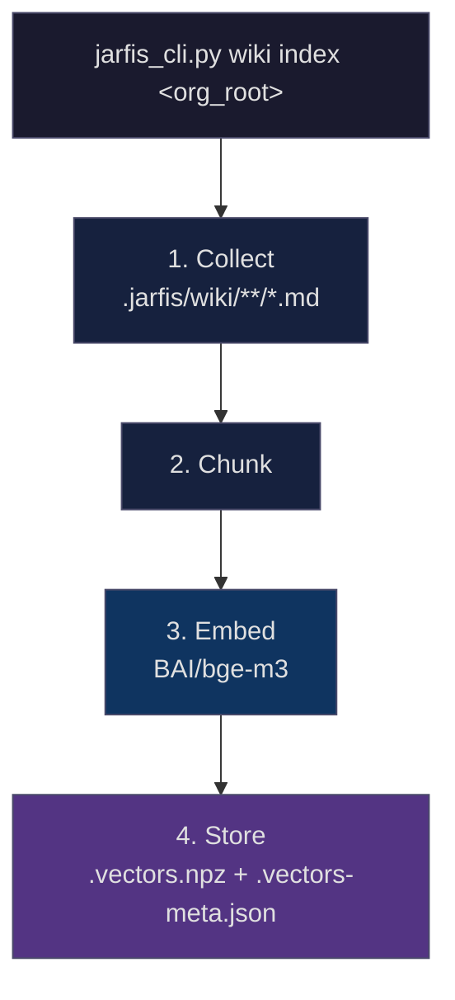
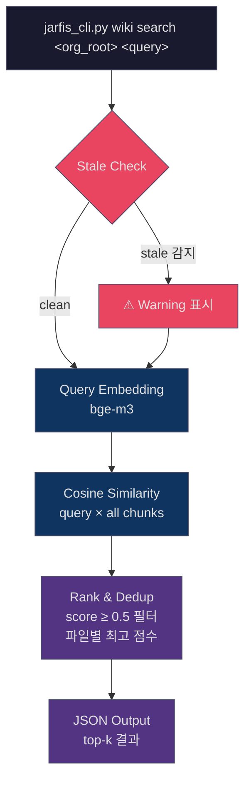

# Wiki Semantic Search

> sentence-transformers bge-m3 기반의 조직 지식 시맨틱 검색 엔진

## Why

JARFIS v2에서 도입된 Organization Wiki는 프로젝트를 횡단하는 누적 지식 저장소입니다.
ADR, 정책, 디자인 패턴, QA 체크리스트가 파일 단위로 쌓이는데, Wiki가 커질수록 "지금 이 기획과 관련된 문서가 뭔가?"를 정확히 찾는 것이 병목이 됩니다.

기존 방식은 LLM이 `_index.md`의 Summary를 읽고 "추측"하는 것이었습니다.
이건 검색이 아니라 선형 스캔입니다.

Wiki Semantic Search는 이 문제를 해결합니다:

- **의미 기반 검색**: "환불"을 검색하면 "refund", "payment cancellation", "결제 취소"도 찾음
- **다국어 지원**: BAAI/bge-m3 모델은 100+ 언어를 지원하며, 한국어/영어 혼용 문서에 최적
- **정량적 관련도**: 코사인 유사도 점수로 관련성을 수치화 (0.5 미만은 자동 제외)

## Architecture

### Indexing Flow



| Step | Input | Process | Output |
|------|-------|---------|--------|
| **Collect** | Wiki 디렉토리 | 모든 `.md` 파일 재귀 탐색 | 파일 목록 + 내용 |
| **Chunk** | 파일 내용 | ≤500 토큰 → 1 청크, >500 토큰 → H2 분할 | 청크 배열 (경로+섹션 프리픽스) |
| **Embed** | 청크 텍스트 | sentence-transformers bge-m3 인코딩 | 정규화된 벡터 |
| **Store** | 벡터 + 메타 | numpy 압축 저장 | `.vectors.npz` + `.vectors-meta.json` |

### Search Flow



## Commands

### `wiki index`

Wiki 디렉토리의 모든 .md 파일을 임베딩하여 검색 인덱스를 생성합니다.

```bash
python3 ~/.claude/scripts/jarfis_cli.py wiki index /path/to/org-root
```

Output:
```json
{
  "status": "indexed",
  "files": 23,
  "chunks": 47,
  "vectors_path": "/path/to/org-root/.jarfis/wiki/.vectors.npz"
}
```

### `wiki search`

쿼리와 가장 관련 높은 Wiki 파일을 반환합니다.

```bash
python3 ~/.claude/scripts/jarfis_cli.py wiki search /path/to/org-root "결제 환불 정책" --top-k 5
```

Output:
```json
{
  "query": "결제 환불 정책",
  "results": [
    {
      "file_path": "PO/policies/refund-policy.md",
      "section": "환불 규정",
      "score": 0.8234,
      "preview": "환불은 결제 후 7일 이내에만 가능하며..."
    },
    {
      "file_path": "TA/decisions/adr-003-payment-gateway.md",
      "section": "결제 게이트웨이 선택",
      "score": 0.6891,
      "preview": "PG사 변경에 따른 환불 API 마이그레이션..."
    }
  ],
  "total_indexed": 47
}
```

### `wiki status`

인덱스 상태를 확인합니다.

```bash
python3 ~/.claude/scripts/jarfis_cli.py wiki status /path/to/org-root
```

Output:
```json
{
  "indexed": true,
  "model": "BAAI/bge-m3",
  "total_files": 23,
  "total_chunks": 47,
  "indexed_at": "2026-03-23T14:30:00",
  "stale_files": 2,
  "stale_list": ["PO/policies/refund-policy.md", "TA/decisions/adr-005.md"]
}
```

## Integration Points

Wiki Semantic Search는 JARFIS 워크플로우에 3곳에서 자동으로 통합됩니다:

### 1. Wiki 4-Step Loading (Phase 0)

`wiki-loading.md`의 Step 3에서 기존 "LLM 판단" 대신 시맨틱 검색을 사용합니다.

```
Step 1: INDEX.md 읽기
Step 2: 4개 _index.md 읽기
Step 3: ← 여기서 시맨틱 검색 (jarfis_cli.py wiki search)
Step 4: Cascading Specificity 적용
```

검색 실패 시(인덱스 없음/모듈 미설치) → 기존 LLM 판단으로 자동 폴백합니다.

### 2. Phase 6 Retrospective

Wiki 2-트랙 갱신 후 자동으로 인덱스를 리빌드합니다.
실패해도 워크플로우를 중단하지 않습니다 (best-effort).

### 3. Org Init

`/jarfis:org-init` 완료 후 최초 인덱싱 안내를 표시합니다.

## Chunking Strategy

| 조건 | 전략 | 예시 |
|------|------|------|
| 파일 ≤ 500 토큰 | 전체 파일 = 1 청크 | 짧은 정책 문서 |
| 파일 > 500 토큰 | H2(##) 섹션 단위 분할 | 긴 ADR, 아키텍처 문서 |

각 청크에는 `[파일경로] [섹션명]` 프리픽스가 붙어 임베딩 시 문맥이 보존됩니다.
YAML frontmatter는 메타데이터로 추출되며 임베딩에는 포함되지 않습니다.

## Tech Stack

| Component | Technology | Purpose |
|-----------|------------|---------|
| Embedding Model | [BAAI/bge-m3](https://huggingface.co/BAAI/bge-m3) | 다국어 문서 임베딩 (100+ 언어, 8192 토큰) |
| ML Framework | [sentence-transformers](https://sbert.net/) | 모델 로딩 및 인퍼런스 |
| Vector Storage | numpy `.npz` | 경량 벡터 저장 (별도 DB 불필요) |
| Similarity | Cosine similarity (dot product) | 정규화된 벡터 간 유사도 계산 |
| Metadata | JSON | 청크 정보, 인덱싱 시각, staleness 추적 |

## Installation

```bash
pip3 install sentence-transformers
```

최초 `wiki index` 실행 시 bge-m3 모델이 자동 다운로드됩니다 (~2GB).
이후에는 로컬 캐시에서 로드됩니다.

## Fallback Policy

sentence-transformers가 설치되지 않은 환경에서도 JARFIS는 정상 작동합니다:

1. `wiki search` 호출 시 → 미설치 안내 메시지 + `pip install` 명령어 제공
2. `wiki-loading.md` Step 3 → 기존 방식 (LLM이 `_index.md` Summary 기반으로 판단)으로 자동 폴백
3. 워크플로우 중단 없음 — 검색 품질만 차이

**시맨틱 검색은 선택적 강화(optional enhancement)이며, 필수 의존성이 아닙니다.**
