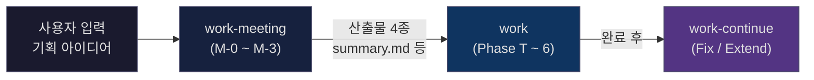
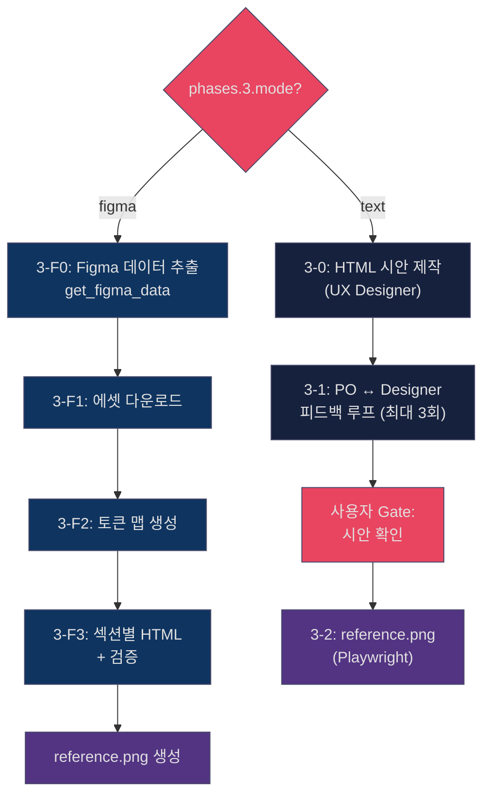
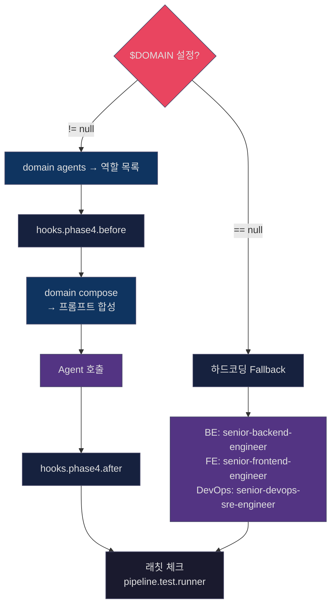
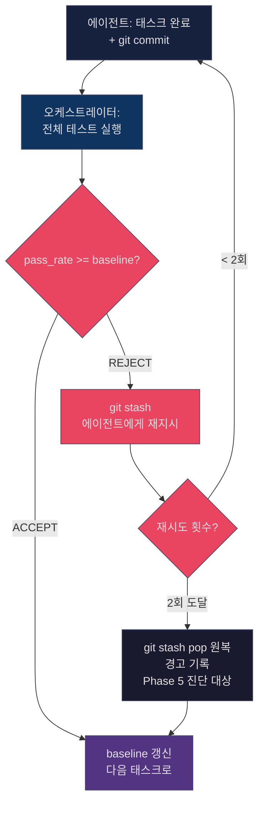
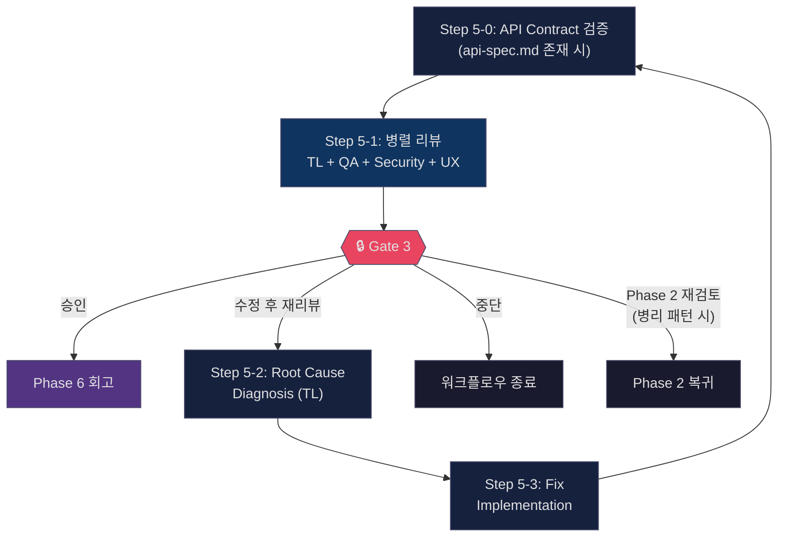
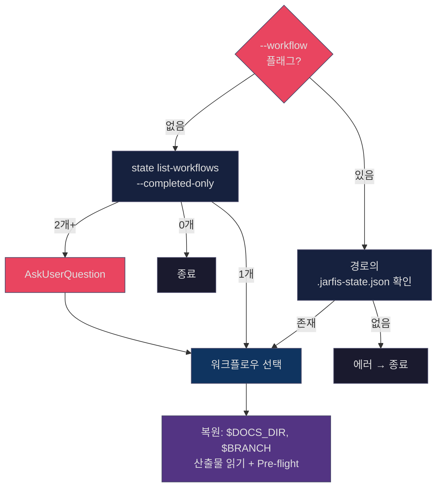
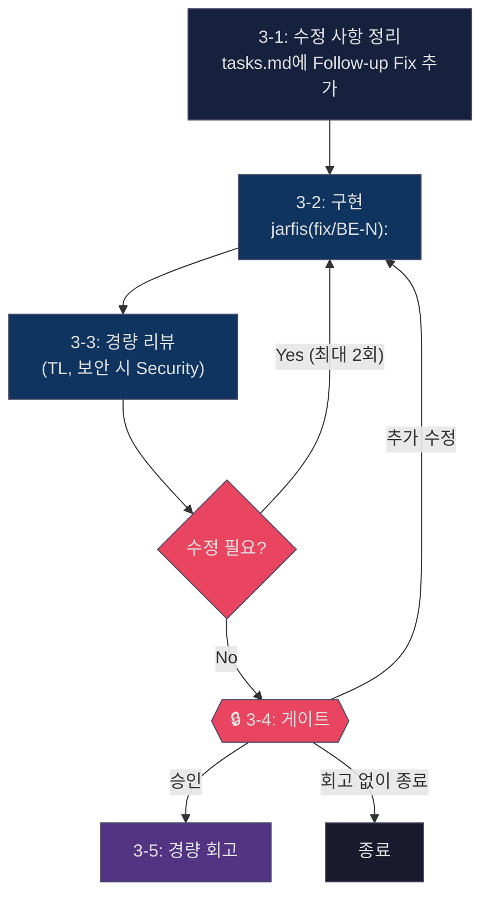
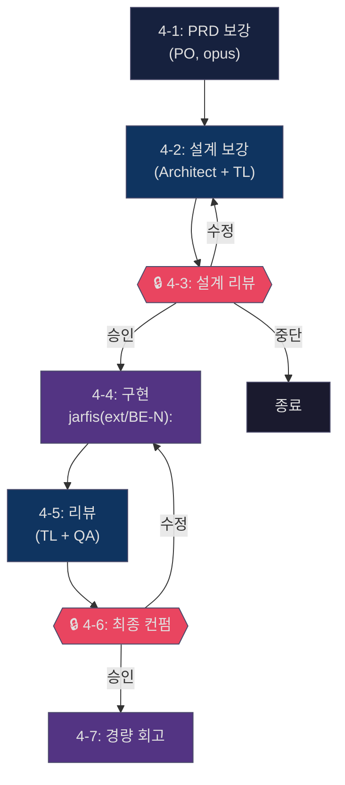

# JARFIS Workflow Guide

> JARFIS 워크플로우의 전체 흐름, 3가지 커맨드 관계, 각 Phase 상세를 설명합니다.
> 독자: JARFIS를 사용하면서 Phase 단위 동작을 이해하고 싶은 사용자

---

## 3개 커맨드 관계



| 커맨드 | 역할 | 진입점 |
|--------|------|--------|
| `/jarfis:work-meeting` | PO+TL 역할극으로 기획 아이디어 탐색 | 사용자가 기획 주제 입력 |
| `/jarfis:work` | 전체 워크플로우 오케스트레이션 (Phase T~6) | meeting 산출물 자동 감지 또는 직접 입력 |
| `/jarfis:work-continue` | 완료된 워크플로우의 후속 작업 (Fix/Extend) | 이전 워크플로우 자동 탐색 |

**흐름**: meeting 결과 → work가 시맨틱 검색으로 자동 감지 → work 완료 후 continue로 수정/확장

---

## 3중 중첩 루프 구조

```
┌─ Evolution Loop (워크플로우 간 학습: learnings.md, project-context.md) ────────┐
│                                                                                 │
│  ┌─ Workflow Loop (Phase T → 0 → 1 🔒 → 2&3 🔒 → 4 → 4.5 → 5 🔒 → 6) ───┐  │
│  │                                                                           │  │
│  │  ┌─ Ratchet Loop (Phase 내부 품질 검증) ────────────────────────┐         │  │
│  │  │  PRD Ratchet (Phase 1): 5항목 채점, 최대 2회 재시도          │         │  │
│  │  │  TDD Ratchet (Phase 4): pass_rate >= baseline, 태스크당 2회  │         │  │
│  │  │  Fix Ratchet (continue): 수정 → 리뷰 → 최대 2회 재시도      │         │  │
│  │  └──────────────────────────────────────────────────────────────┘         │  │
│  │                                                                           │  │
│  └───────────────────────────────────────────────────────────────────────────┘  │
│                                                                                 │
│  Phase 6 회고 → learnings.md + project-context.md 갱신 → 다음 워크플로우 강화   │
└─────────────────────────────────────────────────────────────────────────────────┘
```

- **Ratchet Loop**: Phase 내부에서 품질 기준 미달 시 재시도 (P4: Dialectic Quality)
- **Workflow Loop**: Phase T부터 6까지 순차 실행, Gate에서 사용자 판단 (P8: Human Gate)
- **Evolution Loop**: 워크플로우 완료마다 학습 축적 → 에이전트 강화 (P3: Self-Evolution)

---

## work-meeting: 기획 킥오프 미팅 (M-0 ~ M-3)

### M-0: Setup (미팅 준비)

1. **기획명 결정**: `$ARGUMENTS`에서 추출 → kebab-case 변환 → AskUserQuestion으로 확인
2. **디렉토리 생성**: `$JARFIS_WORKSPACE_DIR/meetings/{YYYYMMDD}-{기획명}/`
   - 동일 기획명 존재 시: 이어서 진행 또는 새로 시작 선택
3. **컨텍스트 로드**: `jarfis_cli.py preflight` 실행
   - `project-profile.md`, `learnings.md`, `project-context.md` 로드 (없어도 진행 가능)
4. **미팅 안내 배너** 출력: 참석자(PO/TL), 명령어("정리해줘"→중간요약, "마무리"→종료+산출물)

### M-1: Opening Round (첫인상 공유)

PO와 TL이 기획 주제에 대한 첫인상을 각각 공유한다:

```
[PO] 비즈니스 관점 첫인상 + 타겟 사용자 가설 + 핵심 질문 1~2개
[TL] 기술 관점 첫인상 + 기존 시스템 연계 포인트 + 기술적 질문/우려
→ 사용자님, 어떻게 생각하시나요?
```

**역할 연기 규칙** (전체 미팅 공통):
- PO 렌즈: 비즈니스 가치/ROI, 사용자 경험, 시장 적합성, MVP 범위, KPI
- TL 렌즈: 기술 스택 트레이드오프, 아키텍처 패턴, 기존 시스템 호환, 기술 부채, 일정 영향
- 발언 순서 자유, 의견 불일치 환영, 프로젝트 프로필 반영

### M-2: Free-Form Rounds (자유 토론)

사용자 입력마다 1라운드 진행. 내용 성격(비즈니스/기술)에 따라 반응 순서가 달라진다.

**중간 저장 메커니즘** (P9: Resilient Continuity, P7: Deterministic Foundation):
- `.round-count` 파일로 라운드 카운팅 (LLM 직접 카운팅 금지)
- **5라운드마다** `meeting-notes.md` 자동 중간 저장
- "정리해줘" 입력 시에도 중간 저장 실행
- `jarfis-pre-compact.sh` 훅이 auto-compact 직전에 미팅 파일 자동 백업 (최대 20개 유지)

**전문가 소환 프로토콜**:
- PO/TL이 전문 지식 필요 시 자율적으로 Architect/Security/DevOps/UX/QA 소환
- 조사 결과는 `tech-research.md`에 누적 기록

### M-3: Wrap-up (마무리 및 산출물 생성)

**트리거**: "마무리", "끝", "종료", "wrap up", "wrap-up"

**산출물 4종** (`$MEETING_DIR/`에 생성):

| 파일 | 내용 | 비고 |
|------|------|------|
| `summary.md` | 미팅 요약 (YAML frontmatter) | work.md 자동 감지용 |
| `meeting-notes.md` | 토픽별 정리 회의록 | |
| `decisions.md` | 의사결정 추적표 | |
| `tech-research.md` | 전문가 조사 결과 | 소환 시에만 생성 |

완료 후 안내: `/jarfis:work $ARGUMENTS --meeting $MEETING_NAME`

---

## work: 전체 워크플로우 (Phase T ~ 6)

### 전체 흐름


> 🔒 = Gate Point (AskUserQuestion 필수, P8: Human Gate)

---

### Phase T: Triage (요청 분류)

워크플로우 진입 여부를 판단하는 최초 게이트.

| 유형 | 판단 기준 | 워크플로우 진입 |
|------|----------|---------------|
| **A. 신규 기획/기능** | 새 기능 구현, 리팩토링, 시스템 설계 필요 | Phase 0부터 정상 실행 |
| **B. 부분 실행** | 기존 워크플로우의 특정 Phase만 필요 | 해당 Phase만 (사용자 확인 후) |
| **C. 워크플로우 부적합** | 단순 질문, 디버깅, 설정 변경 | 워크플로우 없이 직접 처리 |

**유형 B 매핑**:

| 요청 패턴 | 매핑 Phase |
|----------|-----------|
| QA, 테스트, 검증 | Phase 5 (Review & QA) |
| 설계 리뷰, 아키텍처 검토 | Phase 2 (Architecture) |
| UX 피드백, 화면 설계 수정 | Phase 3 (UX Design) |
| 추가 구현, 버그 수정 (기존 PRD 기반) | Phase 4 (Implementation) |
| 배포 전략, 롤백 계획 | Phase 4.5 (Ops Readiness) |

- `.jarfis-state.json` 존재 시 유형 B 가능성이 높음
- 유형 B는 원래 피처 브랜치에서 분기 (`.jarfis-state.json`의 `branch` 필드 참조)

---

### Phase 0: Pre-flight (사전 준비)

목표: 학습 파일 로드 + 프로젝트 구조 파악 + Git 브랜치 설정

#### Step 0-a: 작업물명 및 브랜치 설정

1. AskUserQuestion으로 작업물명 입력 (예: `feat/TICKET-123`)
2. `$WORK_DIR_NAME` = `{YYYYMMDD}-{type}-{ticket-name}` (예: `20260311-feat-TICKET-123`)
3. `$BRANCH` = 원본 입력값 유지 (예: `feat/TICKET-123`)
4. `$DOCS_DIR` = `$JARFIS_ORG_DIR/works/$WORK_DIR_NAME/`
5. 상태 파일 초기화: `jarfis_cli.py state init`

#### Step 0-a-2: Meeting 선택 (시맨틱 검색 + fallback)

```
시맨틱 검색 우선:
  jarfis_cli.py search meetings "$ARGUMENTS" --top-k 3
  └─ 결과 있음 → AskUserQuestion으로 추천 표시
  └─ 결과 없음/실패 → fallback

Fallback (최근 미팅 목록):
  jarfis_cli.py meetings 3
  └─ 결과 있음 → AskUserQuestion
  └─ 빈 배열 → 미팅 선택 스킵

--meeting {기획명} 플래그 → 자동 매칭 (AskUserQuestion 스킵)
```

#### Step 0-a-3: Meeting 컨텍스트 로드

선택된 미팅의 4개 파일을 변수에 매핑:
- `summary.md` → `$MEETING_SUMMARY`
- `decisions.md` → `$MEETING_DECISIONS`
- `meeting-notes.md` → `$MEETING_NOTES`
- `tech-research.md` → `$MEETING_RESEARCH`
- 추가 `.md` 파일 → `$MEETING_EXTRA` (상한 200줄)

#### Step 0-a-4: Workspace Detection (프로젝트 구조 확인)

AskUserQuestion으로 확인:

| 선택 | workspace.type | BE path | FE path |
|------|---------------|---------|---------|
| Monorepo | monorepo | `.` | `.` |
| Multi-project | multi-project | 입력 | 입력 |
| FE만 | monorepo | `N/A` | `.` 또는 입력 |
| BE만 | monorepo | `.` 또는 입력 | `N/A` |

각 경로에서 `jarfis_cli.py detect` 실행하여 프레임워크/언어 자동 감지.

#### Step 0-a-5: Domain 감지 (v3.0)

```bash
jarfis_cli.py domain detect "$PROJECT_PATH"
```
- 감지 성공 → `$DOMAIN` 설정 (Phase 4에서 `domain compose`로 Skills+Rules 합성)
- `tie`=true → AskUserQuestion으로 사용자 선택
- 감지 실패 → `$DOMAIN` = `null` (Phase 4에서 하드코딩 fallback)

#### Step 0-b: Git 브랜치 동기화

- monorepo: 기본 브랜치+develop pull → `git checkout -b $BRANCH develop`
- multi-project: BE/FE 각 경로에서 독립 실행
- develop 없으면 기본 브랜치에서 분기 여부 AskUserQuestion

#### Step 1~2: Pre-flight 검증 및 Wiki 로딩

1. **시스템 헬스체크**: `claude-cleanup.sh` 존재 시 좀비 프로세스 진단
2. **Pre-flight 검증**: `jarfis_cli.py preflight --check-meetings`
   - `$LEARNINGS`, `$PROJECT_CONTEXT`, 프로필 로드 (없으면 빈 문자열)
   - 미완료 워크플로우 감지 시 경고
3. **Wiki 4-Step 로딩** (Org 등록 시): INDEX.md → 4개 _index.md → 관련 파일 최대 5개
4. **Cascading Specificity 규칙**: `$DOCS_DIR > .jarfis > wiki/ > INDEX.md`

**주입 규칙** (Phase별 컨텍스트 분배):

| Phase | 주입 컨텍스트 |
|-------|-------------|
| Phase 1 (PO, Architect) | `$LEARNINGS` Workflow Patterns + `$PROJECT_CONTEXT` + `$WIKI_CONTEXT` |
| Phase 2 (Architect) | `$BE_PROJECT_PROFILE` + `$FE_PROJECT_PROFILE` + `$WIKI_CONTEXT` |
| Phase 4 (BE/FE/DevOps) | `$DOMAIN` 시 `domain compose` / null 시 Agent Hints + Profile |
| Phase 5 (TL/QA/Security) | `$LEARNINGS` 해당 역할 Agent Hints |

---

### Phase 1: Discovery

목표: 기획 의도 명확화 + 기술적 실현가능성 검증

#### 실행 순서

```
Step 1-0: PO Wiki 참조 (Org 등록 시)
  ↓
Step 1-1: PO 역질문 (5관점)
  ↓ 사용자 답변
Step 1-1.5: Working Backwards Document (가상 프레스 릴리스 + FAQ)
  ↓
Step 1-2: PRD 작성 + 실현가능성 평가 (PO + Architect 병렬)
  ↓
Step 1-2.5: PRD Completeness Check — Ratchet
  ↓
🔒 Gate 1: 승인 / 수정 / 중단
  ↓ 승인 시
Step 1-3: PO 추가 태스크 (법무체크, UX방향서, 디자이너유무, 반응형범위)
```

#### PRD Ratchet (Step 1-2.5)

오케스트레이터가 직접 실행 (에이전트 아님, P4: Dialectic Quality).

**채점 기준** (각 항목 0~2점, 총 10점):

| 항목 | 2점 (Pass) 기준 |
|------|----------------|
| 모호 표현 | "적절한/빠른/충분한" 등이 모두 구체적 수치로 전환됨 |
| KPI 측정 가능성 | 숫자 + 측정 방법 모두 명시 |
| Performance Budget | 모든 지표에 숫자 + 측정 방법 |
| Required Roles 근거 | 모든 역할에 1문장 이상 근거 |
| 스코프 경계 | 포함 + 제외 범위 모두 명시 |

**래칫 로직**:
1. 최초 생성 → 5항목 채점
2. 전 항목 Pass → Gate 1 진행
3. Fail 항목 존재 → PO에게 해당 항목만 재작성 지시
4. 재채점 시 **이전 Pass 항목이 Fail로 변하면 래칫 위반** → PO에게 경고 재지시
5. **최대 2회 시도** 후에도 Fail → Gate 1에 점수 표시, 사용자 판단

> 불변 평가자 원칙: 채점 기준은 오케스트레이터 전용. PO 프롬프트에 포함하지 않음.

#### Gate 1

산출물 요약 + PRD Completeness Score 표시 → AskUserQuestion:
- 승인 → Phase 2&3 진행
- 수정 요청 → PO 재작성
- 중단 → 워크플로우 종료

#### Step 1-3: PO 추가 태스크 (Gate 1 승인 후)

- **디자이너 유무 확인** (UX Designer 필요 시):
  - "예" → Figma 페이지 URL 입력 → `phases.3.mode: "figma"`
  - "아니오" → AI 에이전트 디자인 → `phases.3.mode: "text"`
- **법무/컴플라이언스 체크**: 선택적
- **UX 방향서 작성**: `ux-direction.md` (IA, Tone & Voice, Pages + 인터랙션 패턴)
- **반응형 범위 설정** (FE 필요 시): PC만 / PC+Mobile / PC+Mobile+Tablet

---

### Phase 2&3: Architecture + UX (병렬)

Phase 2와 Phase 3은 동시에 실행한다. Phase 3 스킵 조건 해당 시 Phase 2만 진행.

#### Phase 2: Architecture & Planning

```
Step 2-(-1): TA/QA Wiki 참조 (Org 등록 시)
  ↓
Step 2-0: Impact Analysis (Architect)
  ↓
Step 2-1: 시스템 아키텍처 설계 + ADR (Architect)
  ↓
Step 2-1.5: API 명세 작성 (Architect → TL 리뷰) — BE+FE 모두 필요 시만
  ↓
Step 2-2: 태스크 분해 (Tech Lead) — tasks.md
  ↓
Step 2-3: 테스트 전략 수립 (QA) — test-strategy.md
```

**산출물**: `impact-analysis.md`, `architecture.md`, `api-spec.md` (조건부), `tasks.md`, `test-strategy.md`

#### Phase 3: UX Design (조건부)

**스킵 조건**: FE 불필요 또는 UX Designer 불필요

**MCP 도구 가용성 체크** (Step 3-(-2)):
- Figma 모드: Framelink (필수) + Playwright (필수) + mcp-design-comparison (권장)
- Text 모드: Playwright (필수) + mcp-design-comparison (권장)
- 필수 도구 누락 시 AskUserQuestion, 권장 도구 누락 시 경고만

**분기**:



**reference.png**: Phase 5 UX Review에서 비교 기준으로 사용. Figma/Text 양쪽 모두 동일 경로.

#### Gate 2

산출물 요약 (impact-analysis, architecture, api-spec, tasks, test-strategy, design/) 표시
→ AskUserQuestion: 승인 / 수정 요청 / 중단

---

### Phase 4: Implementation

목표: 설계 문서 기반 병렬 구현

#### 실행 순서

```
Step 4-0: 보안 사전 리뷰 (Security Engineer)
  ↓
Step 4-0.5: 테스트 선행 작성 — TDD Red Phase (QA) — 조건부
  ↓
Step 4-0.5a: TDD Baseline 기록 (오케스트레이터)
  ↓
Step 4-1: 병렬 구현 — Ratchet Loop (BE/FE/DevOps 동시)
```

#### Security 사전 리뷰 (Step 4-0)

구현 시작 전 Security Engineer가 설계 문서를 기반으로 보안 관점 사전 리뷰 수행.

#### TDD Red Phase (Step 4-0.5) — 조건부

**실행 조건**: `test-strategy.md` 존재 + P0 시나리오 3개 이상 + 테스트 프레임워크 존재
- 활성화 시: `phases.4.tdd_enabled: true`
- 스킵 시: `phases.4.tdd_enabled: false`

#### Domain 분기 — 에이전트 매핑 (Step 4-1)



#### TDD Ratchet (Step 4-1, `tdd_enabled: true` 시)

오케스트레이터가 각 태스크 완료 후 실행:



**테스트 파일 수정 감지**: `tests/`, `__tests__/`, `*.test.*`, `*.spec.*` 변경 시 기록 → Phase 5 QA에서 타당성 사후 검증

> Anti-pattern: Phase 4 전체 반복 금지. 태스크당 2회 초과 재시도 금지.

---

### Phase 4.5: Operational Readiness

목표: 프로덕션 투입 전 배포 전략과 운영 준비 상태 점검

**Step 4.5-1: 배포 전략 + 운영 준비도** (Tech Lead)

산출물: `deployment-plan.md` (배포 전략 + 롤백 계획 + 운영 준비도 체크리스트)

**Adaptive Skip**: `required_roles.devops == false`이면 5항목 체크리스트로 축소

---

### Phase 5: Review & QA

목표: Phase 4에서 실제 실행된 파트의 코드만 리뷰

#### 실행 순서



**리뷰 에이전트**:
- Tech Lead (opus): 코드리뷰 — 설계 준수, 코드 품질
- QA (opus): 테스트 검증 — 커버리지, 시나리오 검증
- Security (opus): 보안리뷰 — 취약점, OWASP 체크
- UX Designer (opus): UX Design Review — dev 서버 URL 필요, Playwright로 HTML 시안 vs 구현물 비교

**병리 패턴 감지** (2회차 이상 재리뷰 시):
- **Stagnation**: 동일 이슈가 반복
- **Regression**: 수정 시 다른 곳이 깨짐
- **Oscillation**: A 수정 → B 깨짐 → B 수정 → A 깨짐

병리 패턴 감지 시 Gate 3에 4번째 옵션 추가: "Phase 2 설계 재검토"

#### Gate 3

리뷰 결과 요약 표시 → AskUserQuestion:
- 승인 → Phase 6 회고
- 수정 후 재리뷰 → Step 5-2 진단 → Step 5-3 수정 → 재실행
- 중단 → 워크플로우 종료
- Phase 2 설계 재검토 (병리 패턴 감지 시) → Phase 2 복귀

---

### Phase 6: Retrospective (자동 실행)

목표: 학습 축적 + wiki 갱신 (P3: Self-Evolution)

#### 실행 순서

```
Step 6-1: 회고 작성 (Tech Lead) → retrospective.md
  ↓
Step 6-2: 학습 파일 업데이트 (오케스트레이터)
  ├─ learnings.md (Org별 — Agent Hints + Workflow Patterns)
  └─ project-context.md (프로젝트별 — 코드베이스 고유 지식)
  ↓
Step 6-2.5: Workflow Metrics 기록 → workflow-metrics.tsv (best-effort)
  ↓
Step 6-3: Wiki 갱신 (Org 등록 시만)
  ├─ 트랙 A: 텍스트 Wiki (PO/TA/QA) — 산출물에서 누적 지식 추출
  └─ 트랙 B: DESIGN HTML 동기화 (FE 포함 시) — design/ → wiki/DESIGN/
  ↓
Step 6-4: 워크플로우 완료 상태 기록
  jarfis_cli.py state set "status" "completed"
  key_decisions 필드에 Gate 1/2/3 핵심 결정사항 기록
```

---

## work-continue: 후속 작업 (Fix / Extend)

### Step 0: 이전 워크플로우 탐색



### Step 1: 후속 작업 분류

`--mode fix|extend` 플래그 있으면 자동 분류 스킵.

| 신호 | 모드 |
|------|------|
| "수정", "버그", "fix", "고쳐", "안 돼", "에러", "테스트 실패" | **Fix** |
| "추가", "기능", "새로", "확장", "더", "리팩토링" | **Extend** |
| 판단 불가 | AskUserQuestion |

### Fix 모드 실행 흐름



### Extend 모드 실행 흐름



### Git 브랜치 처리 (Step 2)

- 현재 브랜치가 `$BRANCH`가 아니면 `git checkout $BRANCH`
- 브랜치 삭제/부재 시 기본 브랜치에서 `$WORK_NAME-follow-up` 생성
- uncommitted 변경사항 있으면 사용자에게 경고
- `.jarfis-state.json`에 follow-up 정보 기록 (`iteration` 필드로 반복 횟수 추적)

### Step 5: 완료

완료 배너 표시 + `.jarfis-state.json` follow_up.status = `"completed"`

---

## Gate 공통 규칙

1. **AskUserQuestion 필수** — 텍스트 출력만으로 자동 진행 금지 (P8: Human Gate, AI Execute)
2. **산출물 요약 표시** — 게이트 전에 해당 Phase 산출물을 요약하여 보여줌
3. **3가지 기본 옵션**: 승인 / 수정 요청 / 중단
4. 수정 → 해당 Phase 에이전트 재실행, 승인 → 다음 Phase 자동 진행, 중단 → 즉시 종료

---

## Skip Rules

| 대상 | 스킵 조건 |
|------|----------|
| Phase 3 전체 | UX Designer 불필요 (PRD Required Roles) |
| Phase 4 파트별 | `tasks.md` 해당 섹션이 `N/A` |
| Step 4-0.5 (TDD) | `test-strategy.md` 없음 or P0 시나리오 3개 미만 or 테스트 프레임워크 없음 |
| Step 2-1.5 (API Spec) | BE+FE 모두 필요하지 않을 때 |
| Phase 4.5 경량화 | `required_roles.devops == false` → 5항목 체크리스트로 축소 |
| Phase 5 파트별 | Phase 4에서 스킵된 파트는 리뷰에서도 제외 |

---

## Context Resilience (컨텍스트 유실 방어)

### .jarfis-state.json — 단일 진실 공급원 (SSOT)

모든 워크플로우 상태를 `$DOCS_DIR/.jarfis-state.json`에 기록한다 (P9: Resilient Continuity).

- Phase 시작/완료, 에이전트 상태, Gate 결과, 래칫 상태 등 전부 기록
- 매 Phase 시작 전 상태 파일을 읽어 이미 완료된 Phase는 재실행하지 않음
- `jarfis_cli.py state` 명령어로 관리 (P7: Deterministic Foundation)

### PreCompact Hook (`jarfis-pre-compact.sh`)

auto-compact 직전에 자동 실행:
- `.jarfis-state.json` 백업 → `.compact-backups/state_{timestamp}.json` (최대 10개 유지)
- 미팅 파일 백업 (summary, meeting-notes, decisions, tech-research) (최대 20개 유지)
- 백업 메타데이터 기록: `last_compact.json`

### SessionStart Hook (`jarfis-session-start.sh`)

세션 시작 시 자동 실행:
- `jarfis_cli.py state list-workflows`로 미완료 워크플로우 감지
- 미완료 존재 시 Phase, 프로젝트명, 마지막 체크포인트, 핵심 결정사항 표시
- Wiki 미반영 워크플로우 경고

### Resume After Context Compression

1. `.jarfis-state.json` 읽기 (경로 모르면 `$JARFIS_ORG_DIR/works/`에서 최근 탐색)
2. `current_phase`, `last_checkpoint` 확인
3. `in_progress` Phase부터 이어서 진행, `completed` Phase는 재실행하지 않음
4. `.compact-backups/`에서 상태 파일 복구 가능
5. 산출물 파일 존재 여부로 실제 완료 교차 검증

### Safety Hook (`jarfis-safety.sh`)

PreToolUse 훅으로 위험한 Bash 명령을 차단:
- **차단 (exit 2)**: `git push --force`, `--no-verify`, main/master 직접 커밋
- **경고 (exit 0 + stderr)**: `.env` 접근, `rm -rf`, credential 파일, `curl | bash`

### Quality Gate Hook (`jarfis-quality-gate.sh`)

PostToolUse 훅으로 Edit/Write/MultiEdit 후 lint/typecheck 자동 실행:
- `jarfis_cli.py quality-gate "$FILE_PATH"` 호출
- 경고만 표시 (PostToolUse는 차단 불가)
- Kill switch: `JARFIS_QUALITY_GATE=0`

---

## Agent Mapping (역할 → 모델)

> `$DOMAIN` 설정 시 `domain.yaml`의 `roles` 섹션이 이 테이블을 대체한다.
> 아래는 `$DOMAIN=null` fallback 전용.

| 역할 | Agent Type | Model | 용도 |
|------|-----------|-------|------|
| Product Owner | senior-product-owner | opus | 기획, PRD, 역질문 |
| Architect | technical-architect | opus | 아키텍처, Impact Analysis |
| Tech Lead | tech-lead | opus | 태스크 분해, API 리뷰, 코드리뷰 |
| UX Designer | senior-ux-designer | opus | HTML 시안, UX 리뷰 |
| Backend Engineer | senior-backend-engineer | sonnet | BE 구현 |
| Frontend Engineer | senior-frontend-engineer | sonnet | FE 구현 |
| DevOps/SRE | senior-devops-sre-engineer | sonnet | 인프라 구현 |
| QA Engineer | senior-qa-engineer | opus | 테스트 전략, TDD, QA 리뷰 |
| Security Engineer | senior-security-engineer | opus | 보안 사전/사후 리뷰 |

**원칙**: 추론/분석/판단 역할은 opus, 구현 역할은 sonnet (P2: Token Austerity)

---

## 산출물 파일 목록

| Phase | 파일 | 설명 | 조건부 |
|-------|------|------|--------|
| -- | `.jarfis-state.json` | 워크플로우 상태 (SSOT) | 항상 |
| 1 | `press-release.md` | Working Backwards 가상 프레스 릴리스 + FAQ | 항상 |
| 1 | `prd.md` | PRD + 실현가능성 + Required Roles + Performance Budget | 항상 |
| 1 | `ux-direction.md` | UX 방향서 (IA, Tone, Pages + 인터랙션 패턴) | UX Designer 필요 시 |
| 2 | `impact-analysis.md` | 기존 코드베이스 영향 범위 분석 | 항상 |
| 2 | `architecture.md` | 시스템 아키텍처 + ADR | 항상 |
| 2 | `api-spec.md` | API 명세서 | BE+FE 모두 필요 시 |
| 2 | `tasks.md` | 태스크 분해 | 항상 |
| 2 | `test-strategy.md` | 테스트 전략 | 항상 |
| 3 | `design/` | HTML 시안 디렉토리 | FE + UX Designer 필요 시 |
| 4 | `infra-runbook.md` | 수동 인프라 설정 가이드 | DevOps 실행 시 |
| 4.5 | `deployment-plan.md` | 배포 전략 + 롤백 + 운영 준비도 | 항상 |
| 5 | `api-contract-check.md` | API Contract 검증 결과 | api-spec.md 존재 시 |
| 5 | `review.md` | 리뷰 결과 | 항상 |
| 5 | `diagnosis.md` | Root Cause 진단 + 수정 지시서 | 수정 후 재리뷰 시 |
| 6 | `retrospective.md` | 워크플로우 회고 | 항상 |

---

## 참조

- [PHILOSOPHY.md](PHILOSOPHY.md) — 9 Principles (P0~P9)
- 프롬프트 파일: `~/.claude/commands/jarfis/prompts/*.md`
- 템플릿 파일: `~/.claude/commands/jarfis/templates/*.md`
- 훅 파일: `jarfis/hooks/*.sh`
